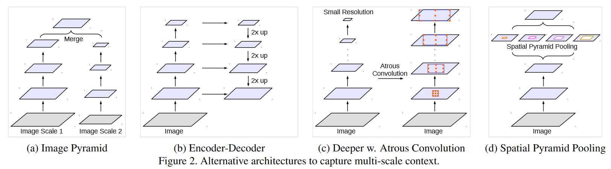
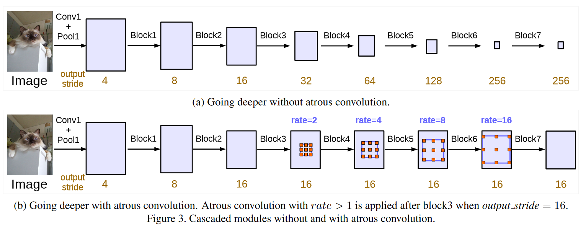
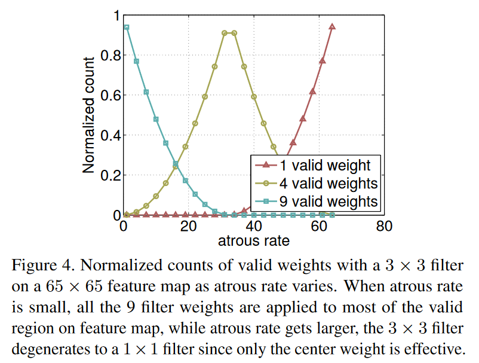
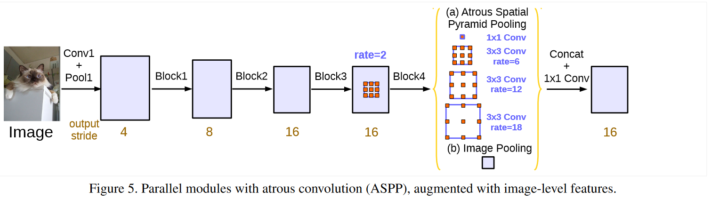

# Rethinking Atrous Convolution for Semantic Image Segmentation

## 摘要

本文中，我们再次讨论atrous卷积，一个调整卷积核感受野的强大工具，并且可以控制深度卷积神经网络计算得到特征的分辨率，应用在图像语义分割上。为了处理在多尺度条件下的语义分割难题，我们设计了**级联和并行**的atrous卷积模块，采用多种不同的孔洞步长来获取多尺度的内容信息。除此之外，我们还提出了多层级空间金字塔式孔洞池化模块，挖掘多尺度卷积特征，以及编码了全局内容信息的图像层特征，提升分割效果。我们还详细阐述了实施细节，并分享了我们训练系统方面的经验。我们提出的**“DeepLabv3"**系统比起我们以前的deeplab版本有了显著的提高，在没有使用全连接条件随机场做后置处理的情况下达到媲美与其他模型在PASCAL VOC2012图像语义分割的性能。

## 引言

对于语义分割的任务，我们考虑了应用深度卷积神经网络（DCNNs）的两个挑战。

第一个是由于连续的池化操作或卷积步幅导致的特征分辨率降低，这使DCNN能够学习越来越多的抽象特征表示。然而，这对局部图像变换的不变性可能妨碍精细的预测任务，这种任务需要详细的空间信息。为了克服这个问题，我们提倡使用atrous卷积，这种方法已被证明在图像语义分割中很有效。atrous卷积，也被称为**扩张卷积**（dilated convolution），使我们能够通过去除最后几层的下采样操作和相应的上采样filter重新调整lmageNet之前训练好的网络来提取出更精细的特征映射，这就相当于在卷积核各个权重之间插入孔洞。使用atrous卷积，能够在深度卷积神经网络不需要学习额外的参数的情况下控制特征映射的分辨率。

另一个困难来自于如何获取尽可能多的目标的总体特征和细节特征，即不同尺度下的特征。已经提出了几种方法来处理这个问题，本文中我们主要提出四个方法，如图2所示。

- 首先，DCNN是应用于图像金字塔从而在每个输入的尺度下提取特征，不同特征映射、不同尺度下目标都很突出。
- 第二，编码器解码器结构在编码器部分就利用起多尺度的特征，解码器部分恢复图像同时保证空间分辨率。
- 第三，用额外添加的模块级联在原来的网络上，从而捕获长跨度的信息。特别是DenseCRF用来编码相连像素的相似性，且开发了几个额外的卷积层级联处理，从而逐步捕获长范围上下文信息。
- 第四，空间金字塔池化探索了用有着多种步长、多种有效感受野的filters或者池化操作处理输入特征映射，从而多尺度条件下捕获目标。

在这项工作中，我们重新研究atrous卷积的应用，在级联模块和空间金字塔池化的框架下，使我们能够有效地扩大filters的视野，以组合多尺度的图片信息。特别是，我们提出的atrous卷积模块中多种孔的步长和批次归一化层，发现在训练中也非常重要。我们的实验按级联或并行排列模块（特别实验了atrous的空间金字塔池化（ASPP）方法）。我们讨论一个重要的现实问题，当应用3×3atrous卷积时孔的步长非常大的时候，因为图像边界的影响就不能捕捉到长跨度的信息，事实上会退化为1×1的卷积，并提出将图像级特征纳入ASPP模块。此外，我们分享了精心设计的一些技术细节和模型的训练经验，包括简单而有效的自助抽样法处理标签稀少和标签精细对象。在最后，我们提出的“DeepLabv3"模型，超越了我们以前的工作，并且在没有使用DenseCRF做最后的处理的情况下在PASCAL VOC2012的测试集上达到了85.7%的正确率。

## 方法

### 3.2 Cascaded model

### 3.3. Atrous Spatial Pyramid Pooling

我们回顾之前提出的atrous空间金字塔池化，四个并行的atrous步长不同atrous卷积被应用在特征映射之上。ASPP是被空间金字塔池化的成功而想到的，空间金字塔池化在用不同尺度重复采样特征提高精确率方面是有效的而且任意的尺度都对分割很有效果。与之前的ASPP不同，本文我们的ASPP加入了**批次归一化**。

具有不同的孔洞步长的ASPP对捕获多尺度信息很有效果。然而，我们发现随着采样率的提高，有效的filter权重（即有效特征区域，而不是补零区域的权重）却在变小。这种影响如图4所示，当把一个3×3的filter用不同的atrous步长应用到65×65的特征映射当中。在极端情况下，步长增大到接近特征映射的尺寸，该3×3的filter 不能捕获整个图像内容，而退化成了一个简单的1×1 filter，因为只有中心filter权重才是有效的。

针对上面的问题，并将全局内容信息整合进模型中，我们采用图像级特征。特别是，我们应用了**全局平均池化**处理模型的特征映射，将得到的图像级特征输入到一个有256个filter的1×1卷积（加入批次归一化）中，然后将特征进行**双线性上采样（bilinearly upsample）**到特定的空间维度。

最后，我们的改进的ASPP由如下组成：

- 一个1×1卷积

- 三个3×3卷积，步长为（6，12，18），输出步长为16（所有的filter个数为256，并加入批次归一化），

如图5所示，（b）是图像级的特征。需要注意的是，当输出步长为8时，步长将加倍。所有分支处理好的特征将会连接在一起通过另一个1×1卷积（也有着256个filter，加入批次归一化），最后还有一个1×1卷积产生最终的分类。

## 结论

我们提出的模型" DeepLabv3 "使用了带上采样滤波器的空洞卷积来提取密集的特征图，并捕获远程上下文。具体来说，为了编码多尺度信息，我们提出的级联模块将空洞率逐渐增加一倍，而我们提出的空洞空间金字塔池化模块在图像级特征的基础上，以多个采样率和有效感受野的滤波器来探测特征。我们的实验结果表明，所提出的模型比以前的DeepLab版本有了显著的改进，并在PASCAL VOC 2012语义图像分割基准上实现了与其他先进模型相当的性能。