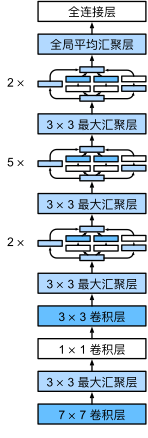

# GoogLeNet 含并行连结的网络

论文：Going Deeper with Convolutions

GoogLeNet吸收了NiN中**串联**网络的思想

## 1. Inception块

在GoogLeNet中，基本的卷积块被称为*Inception块*（Inception block）。


如上图所示，Inception块由四条并行路径组成。 

- 前三条路径使用窗口大小为1×1、3×3和5×5的卷积层，从不同空间大小中提取信息。 中间的两条路径在输入上执行1×1卷积，以减少通道数，从而降低模型的复杂性。 
- 第四条路径使用3×3最大汇聚层，然后使用1×1卷积层来改变通道数。 这四条路径都使用合适的填充来使输入与输出的高和宽一致，最后我们将每条线路的输出在通道维度上连结，并构成Inception块的输出。在Inception块中，通常调整的超参数是每层输出通道数。

```python
class Inception(nn.Module):
    # c1--c4是每条路径的输出通道数
    def __init__(self, in_channels, c1, c2, c3, c4, **kwargs):
        super(Inception, self).__init__(**kwargs)
        # 线路1，单1x1卷积层
        self.p1_1 = nn.Conv2d(in_channels, c1, kernel_size=1)
        # 线路2，1x1卷积层后接3x3卷积层
        self.p2_1 = nn.Conv2d(in_channels, c2[0], kernel_size=1)
        self.p2_2 = nn.Conv2d(c2[0], c2[1], kernel_size=3, padding=1)
        # 线路3，1x1卷积层后接5x5卷积层
        self.p3_1 = nn.Conv2d(in_channels, c3[0], kernel_size=1)
        self.p3_2 = nn.Conv2d(c3[0], c3[1], kernel_size=5, padding=2)
        # 线路4，3x3最大汇聚层后接1x1卷积层
        self.p4_1 = nn.MaxPool2d(kernel_size=3, stride=1, padding=1)
        self.p4_2 = nn.Conv2d(in_channels, c4, kernel_size=1)

    def forward(self, x):
        p1 = F.relu(self.p1_1(x))
        p2 = F.relu(self.p2_2(F.relu(self.p2_1(x))))
        p3 = F.relu(self.p3_2(F.relu(self.p3_1(x))))
        p4 = F.relu(self.p4_2(self.p4_1(x)))
        # 在通道维度上连结输出
        return torch.cat((p1, p2, p3, p4), dim=1)
```

GoogLeNet网络如此有效的原因：

- 首先我们考虑一下滤波器（filter）的组合，它们可以用各种滤波器尺寸探索图像，这意味着不同大小的滤波器可以有效地识别不同范围的图像细节。 
- 同时，我们可以为不同的滤波器分配不同数量的参数。

## 2. GoogLeNet模型

如下图所示，GoogLeNet一共使用**9个Inception块和全局平均汇聚层**的堆叠来生成其估计值。Inception块之间的**最大汇聚层**可降低维度。 第一个模块类似于AlexNet和LeNet，Inception块的组合从VGG继承，全局平均汇聚层避免了在最后使用全连接层。



第一个模块使用64个通道、7×7卷积层。

```python
b1 = nn.Sequential(nn.Conv2d(1, 64, kernel_size=7, stride=2, padding=3),
                   nn.ReLU(),
                   nn.MaxPool2d(kernel_size=3, stride=2, padding=1))
```

第二个模块使用两个卷积层：第一个卷积层是64个通道、1×1卷积层；第二个卷积层使用将通道数量增加三倍的3×3卷积层。 这对应于Inception块中的第二条路径。

```python
b2 = nn.Sequential(nn.Conv2d(64, 64, kernel_size=1),
                   nn.ReLU(),
                   nn.Conv2d(64, 192, kernel_size=3, padding=1),
                   nn.ReLU(),
                   nn.MaxPool2d(kernel_size=3, stride=2, padding=1))
```

第三个模块串联两个完整的Inception块。 

- 第一个Inception块的输出通道数为64+128+32+32=256，四个路径之间的输出通道数量比为64 : 128 : 32 : 32=2:4:1:1。 第二个和第三个路径首先将输入通道的数量分别减少到96/192=1/2和16/192=1/12，然后连接第二个卷积层。
- 第二个Inception块的输出通道数增加到128+192+96+64=480，四个路径之间的输出通道数量比为128:192:96:64=4:6:3:2。 第二条和第三条路径首先将输入通道的数量分别减少到128/256=1/2和32/256=1/8。

```python
b3 = nn.Sequential(Inception(192, 64, (96, 128), (16, 32), 32),
                   Inception(256, 128, (128, 192), (32, 96), 64),
                   nn.MaxPool2d(kernel_size=3, stride=2, padding=1))
```

第四模块更加复杂， 它串联了5个Inception块，其输出通道数分别是192+208+48+64=512、160+224+64+64=512、128+256+64+64=512、112+288+64+64=528和256+320+128+128=832。 这些路径的通道数分配和第三模块中的类似，首先是含3×3卷积层的第二条路径输出最多通道，其次是仅含1×1卷积层的第一条路径，之后是含5×5卷积层的第三条路径和含3×3最大汇聚层的第四条路径。 其中第二、第三条路径都会先按比例减小通道数。 这些比例在各个Inception块中都略有不同。

```python
b4 = nn.Sequential(Inception(480, 192, (96, 208), (16, 48), 64),
                   Inception(512, 160, (112, 224), (24, 64), 64),
                   Inception(512, 128, (128, 256), (24, 64), 64),
                   Inception(512, 112, (144, 288), (32, 64), 64),
                   Inception(528, 256, (160, 320), (32, 128), 128),
                   nn.MaxPool2d(kernel_size=3, stride=2, padding=1))
```

第五模块包含输出通道数为256+320+128+128=832和384+384+128+128=1024的两个Inception块。 其中每条路径通道数的分配思路和第三、第四模块中的一致，只是在具体数值上有所不同。 需要注意的是，第五模块的后面紧跟输出层，该模块同NiN一样使用全局平均汇聚层，将每个通道的高和宽变成1。 最后我们将输出变成二维数组，再接上一个输出个数为标签类别数的全连接层。

```python
b5 = nn.Sequential(Inception(832, 256, (160, 320), (32, 128), 128),
                   Inception(832, 384, (192, 384), (48, 128), 128),
                   nn.AdaptiveAvgPool2d((1,1)),
                   nn.Flatten())

net = nn.Sequential(b1, b2, b3, b4, b5, nn.Linear(1024, 10))
```

GoogLeNet模型的计算复杂，而且不如VGG那样便于修改通道数。