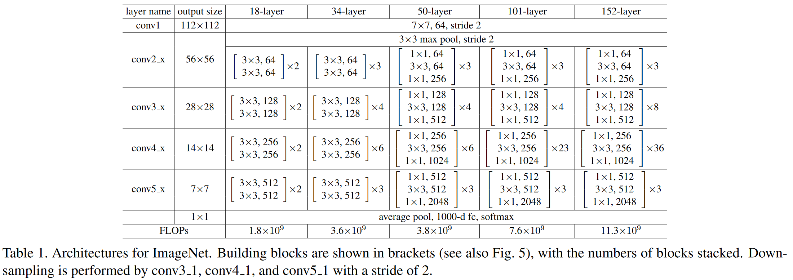
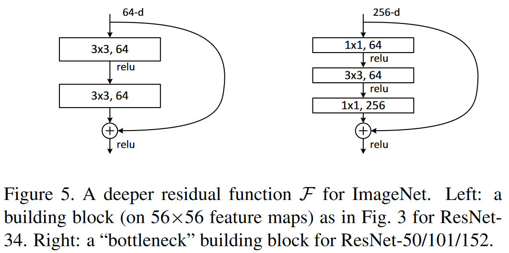

# 残差网络ResNet

论文：Deep Residual Learning for Image Recognition







## 残差块

- ResNet沿用了VGG完整的3×3卷积层设计。 残差块里首先有2个有相同输出通道数的3×3卷积层。 **每个卷积层后接一个批量规范化层和ReLU激活函数**。 

- 然后我们通过跨层数据通路，跳过这2个卷积运算，将输入直接加在最后的ReLU激活函数前。 这样的设计要求2个卷积层的输出与输入形状一样，从而使它们可以相加。 

- 如果想**改变通道数**，就需要引入一个额外的1×1卷积层来将输入变换成需要的形状后再做相加运算。 残差块的实现如下：

```python
class Residual(nn.Module): 
    def __init__(self, input_channels, num_channels,
                 use_1x1conv=False, strides=1):
        super().__init__()
        self.conv1 = nn.Conv2d(input_channels, num_channels,
                               kernel_size=3, padding=1, stride=strides)
        self.conv2 = nn.Conv2d(num_channels, num_channels,
                               kernel_size=3, padding=1)
        if use_1x1conv:
            self.conv3 = nn.Conv2d(input_channels, num_channels,
                                   kernel_size=1, stride=strides)
        else:
            self.conv3 = None
        self.bn1 = nn.BatchNorm2d(num_channels)
        self.bn2 = nn.BatchNorm2d(num_channels)

    def forward(self, X):
        Y = F.relu(self.bn1(self.conv1(X)))
        Y = self.bn2(self.conv2(Y))
        if self.conv3:
            X = self.conv3(X)
        Y += X
        return F.relu(Y)
```

如下图所示，此代码生成两种类型的网络： 一种是当`use_1x1conv=False`时，应用ReLU非线性函数之前，将输入添加到输出。 另一种是当`use_1x1conv=True`时，添加通过1×1卷积调整通道和分辨率。


## ResNet-18模型

前两层跟GoogLeNet中的一样： 在输出通道数为64、步幅为2的7×7**卷积层**后，接步幅为2的3×3的**最大汇聚层**。 不同之处在于ResNet每个卷积层后增加了批量规范化层。

```python
b1 = nn.Sequential(nn.Conv2d(1, 64, kernel_size=7, stride=2, padding=3),
                   nn.BatchNorm2d(64), nn.ReLU(),
                   nn.MaxPool2d(kernel_size=3, stride=2, padding=1))
```

GoogLeNet在后面接了4个由Inception块组成的模块。 ResNet则使用4个由残差块组成的模块，每个模块使用若干个同样输出通道数的**残差块**。 第一个模块的通道数同输入通道数一致。 由于之前已经使用了步幅为2的最大汇聚层，所以无须减小高和宽。 之后的每个模块在第一个残差块里将上一个模块的通道数翻倍，并将高和宽减半。

下面我们来实现这个模块。注意，我们对第一个模块做了特别处理。

```python
def resnet_block(input_channels, num_channels, num_residuals,
                 first_block=False):
    blk = []
    for i in range(num_residuals):
        if i == 0 and not first_block:
            blk.append(Residual(input_channels, num_channels,
                                use_1x1conv=True, strides=2))
        else:
            blk.append(Residual(num_channels, num_channels))
    return blk
```

接着在ResNet加入所有残差块，这里每个模块使用2个残差块。

```python
b2 = nn.Sequential(*resnet_block(64, 64, 2, first_block=True))
b3 = nn.Sequential(*resnet_block(64, 128, 2))
b4 = nn.Sequential(*resnet_block(128, 256, 2))
b5 = nn.Sequential(*resnet_block(256, 512, 2))
```

最后，与GoogLeNet一样，在ResNet中加入全局平均汇聚层，以及全连接层输出。

```python
net = nn.Sequential(b1, b2, b3, b4, b5,
                    nn.AdaptiveAvgPool2d((1,1)),
                    nn.Flatten(), nn.Linear(512, 10))
```

每个模块有4个卷积层（不包括恒等映射的1×1卷积层）。 加上第一个7×7卷积层和最后一个全连接层，共有18层。 因此，这种模型通常被称为**ResNet-18**。 通过配置不同的通道数和模块里的残差块数可以得到不同的ResNet模型，例如更深的含152层的ResNet-152。 虽然ResNet的主体架构跟GoogLeNet类似，但ResNet架构更简单，修改也更方便。这些因素都导致了ResNet迅速被广泛使用。下图描述了完整的ResNet-18。

