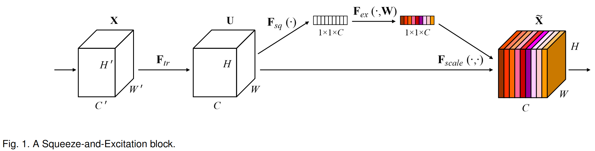
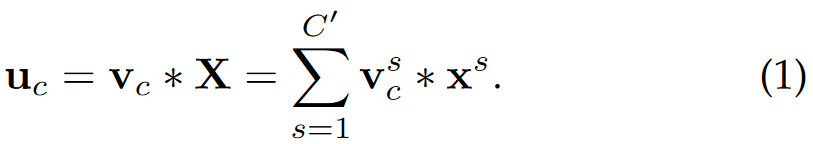
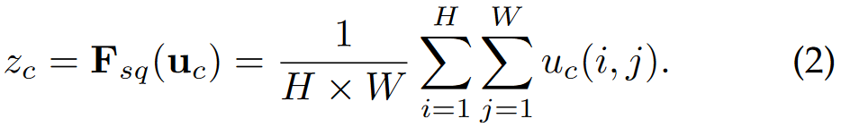
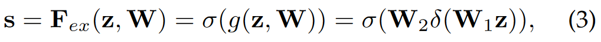
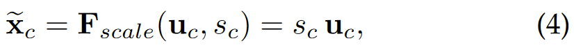
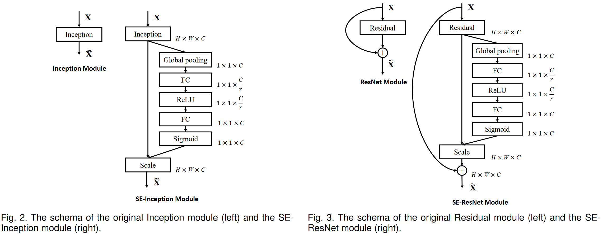

# Squeeze-and-Excitation Networks

> 通道注意力机制

代码：https://github.com/hujie-frank/SENet

## 3 SQUEEZE-AND-EXCITATION BLOCKS

卷积所建模的通道关系本质上是隐式的和局部的（除了顶层的那些）。我们期望通过**显式建模通道间的相互依赖关系**来增强卷积特征的学习，这样网络就能够提高对后续变换中可利用的有用特征的敏感度。因此，我们希望在将其输入到下一次变换之前，通过两个步骤——squeeze和excitation，提供全局信息并重新校准滤波器响应。

$F_{tr}​$的公式就是下面的公式1（卷积操作，$v_c​$表示第c个卷积核，$x^s​$表示第s个输入）。

$F_{tr}$得到的U就是Figure1中的左边第二个三维矩阵，也叫tensor，或者叫C个大小为H\*W的feature map。而$u_c​$表示U中第c个二维矩阵，下标c表示channel。

**Squeeze操作**

接下来就是 Squeeze操作，公式非常简单，就是一个global average pooling:

因此公式2就将$H\times W \times C$的输入转换成1* 1*C的输出，对应Figure1中的$F_{sq}$操作。 为什么会有这一步呢？这一步的结果相当于表明该层C个feature map的数值分布情况，或者叫全局信息。

**Excitation操作**

再接下来就是Excitation操作，如公式3。直接看最后一个等号，前面squeeze得到的结果是z，这里先用$W_1$乘以z，就是一个**全连接层**操作， $W_1​$的维度是C/r * C，这个r是一个缩放参数，在文中取的是16，这个参数的目的是为了减少channel个数从而降低计算量。又因为z的维度是1 * 1 * C，所以W1z的结果就是1* 1* C/r；然后再经过一个ReLU层，输出的维度不变；

然后再和W2相乘，和W2相乘也是一个**全连接层**的过程， W2的维度是C* C/r，因此输出的维度就是1* 1* C；最后再经过sigmoid函数，得到s。

也就是说最后得到的这个s的维度是1* 1*C，C表示channel数目。 这个s其实是本文的核心，它是用来刻画tensor U中C个feature map的权重。而且这个权重是通过前面这些全连接层和非线性层学习得到的，因此可以end-to-end训练。这两个全连接层的作用就是融合各通道的feature map信息，因为前面的squeeze都是在某个channel的feature map里面操作。

**scale操作**

在得到s之后，就可以对原来的tensor U操作了，就是下面的公式4。也很简单，就是channel-wise multiplication，什么意思呢？uc是一个二维矩阵，sc是一个数，也就是权重，因此相当于把uc矩阵中的每个值都乘以sc。对应Figure1中的Fscale。

### 3.3 应用

上左图是将 SE 模块嵌入到 Inception 结构的一个示例。方框旁边的维度信息代表该层的输出。

这里我们使用 global average pooling 作为 Squeeze 操作。紧接着两个 Fully Connected 层组成一个 Bottleneck 结构去建模通道间的相关性，并输出和输入特征同样数目的权重。我们首先将特征维度降低到输入的 1/16，然后经过 ReLu 激活后再通过一个 Fully Connected 层升回到原来的维度。这样做比直接用一个 Fully Connected 层的好处在于：

1）具有更多的非线性，可以更好地拟合通道间复杂的相关性；

2）极大地减少了参数量和计算量。然后通过一个 Sigmoid 的门获得 0~1 之间归一化的权重，最后通过一个 Scale 的操作来将归一化后的权重加权到每个通道的特征上。

除此之外，SE 模块还可以嵌入到含有 skip-connections 的模块中。上右图是将 SE 嵌入到 ResNet 模块中的一个例子，操作过程基本和 SE-Inception 一样，只不过是在 Addition 前对分支上 Residual 的特征进行了特征重标定。如果对 Addition 后主支上的特征进行重标定，由于在主干上存在 0~1 的 scale 操作，在网络较深 BP 优化时就会在靠近输入层容易出现梯度消散的情况，导致模型难以优化。

目前大多数的主流网络都是基于这两种类似的单元通过 repeat 方式叠加来构造的。由此可见，SE 模块可以嵌入到现在几乎所有的网络结构中。通过在原始网络结构的 building block 单元中嵌入 SE 模块，我们可以获得不同种类的 SENet。如 SE-BN-Inception、SE-ResNet、SE-ReNeXt、SE-Inception-ResNet-v2 等等。

## 7 ROLE OF SE BLOCKS

深度学习是黑盒子理论：

尽管提出的SE模块已经被证明可以提高网络在多个视觉任务上的性能，但我们还希望了解压缩操作的相对重要性以及激发机制在实际中的运作方式。对深度神经网络学习到的表示进行严格的理论分析仍然具有挑战性，因此我们采用**经验方法**来检验SE模块的作用，以期至少对其实际功能有一个初步的理解。