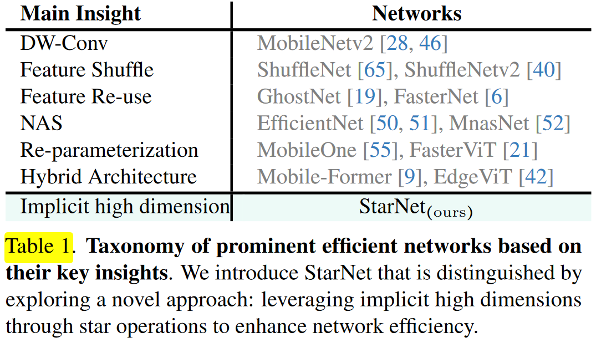
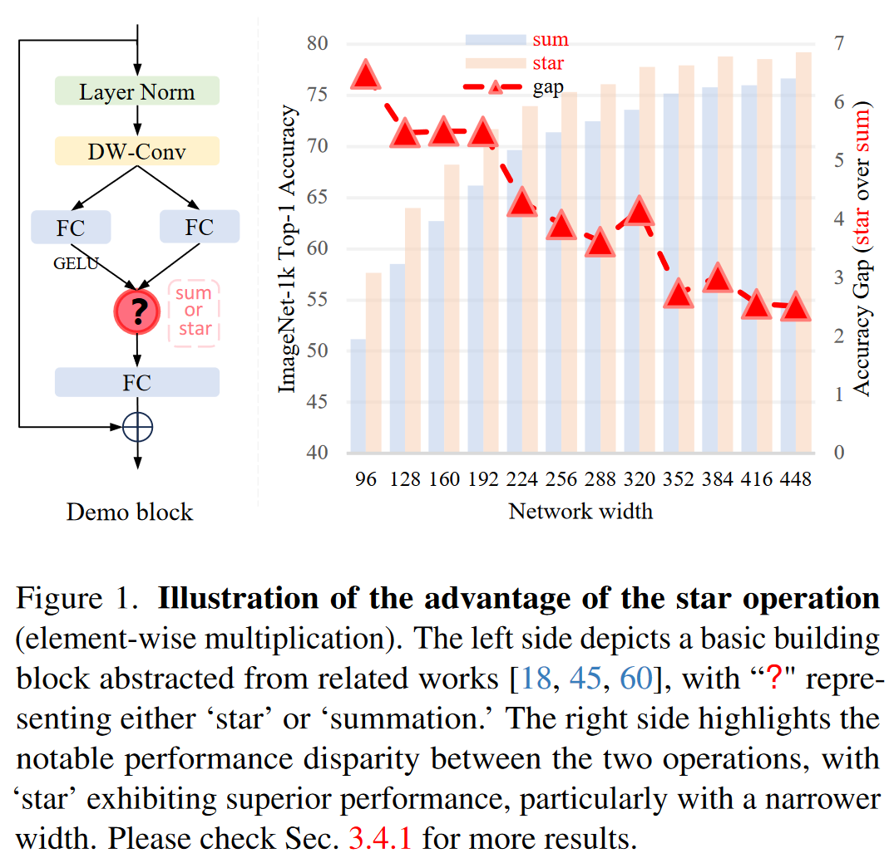
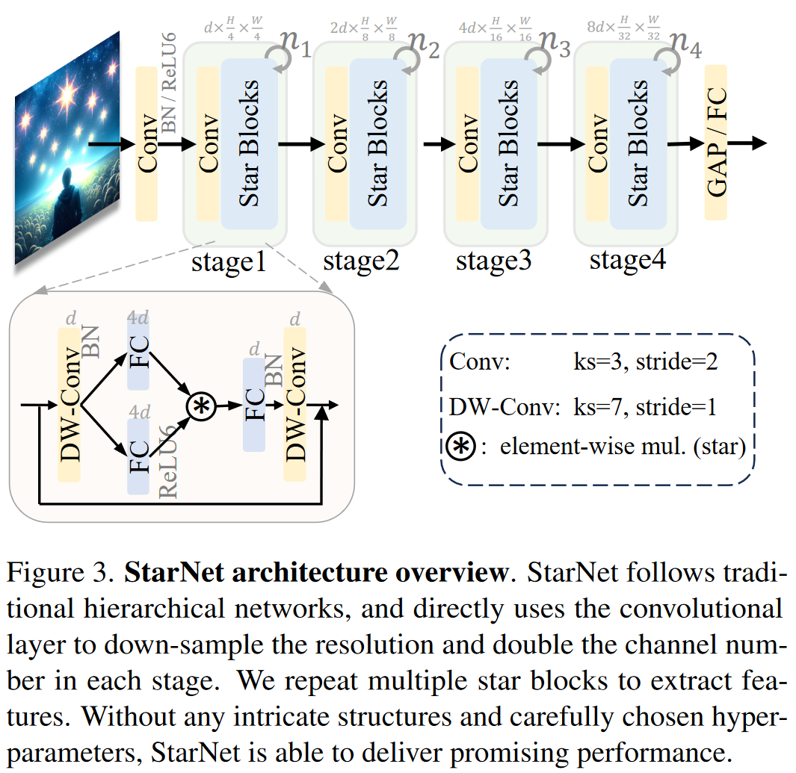
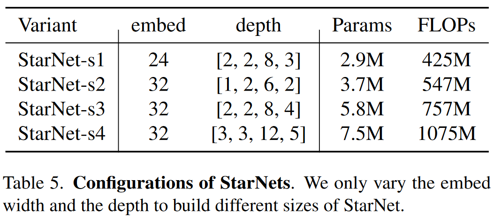

# Rewrite the Stars

代码：https://github.com/ma-xu/Rewrite-the-Stars

1.DW-Conv（深度可分离卷积）：

- 深度可分离卷积是一种减少计算量的技术，它分开处理空间卷积和深度卷积。MobileNetv2利用这种技术来降低模型的计算复杂性。
- 优点：大幅减少计算量和参数数量适用于计算资源受限的环境，如移动设备。

- 缺点：可能会损失一些空间特征的学习能力，并且对于复杂场景需要充分提取和利用深浅特征的场景利用率差一些。

2.Feature Shuffle（特征洗牌）：

- 特征洗牌技术用于改善网络中特征的流动性，增强模型的表达能力。ShuffleNet和ShuffleNetv2通过洗牌操作减少计算量，同时保持特征的有效混合。
- 优点：通过重组特征通道，增强了特征之间的交互。
-  缺点：需要精心设计网络特征融合架构。

3.Feature Re-use（特征重用）：

- 特征重用是一种减少模型参数和计算量的技术，通过重用已经计算的特征图。GhostNet和FasterNet通过特征重用来构建高效的网络。
- 优点：通过重用已经计算的特征图，减少了计算量和参数数量；可以有效增加模型的深度而不受参数量的限制。 
- 缺点：需要精心设计网络特征融合架构；重用特征可能导致信息的损失，影响模型性能。

4.Re-parameterization（重新参数化）：

- 重新参数化是一种技术，通过改变网络的参数表示来减少计算量或提高性能。MobileOne和FasterViT通过重新参数化技术来优化网络。 
- 优点：通过改变网络参数的表示方式，可以减少参数数量或提高性能。
- 缺点：重新参数化可能会引入额外的设计复杂性。

5.Hybrid Architecture（混合架构）： 

- 混合架构结合了不同的网络设计原则，以提高效率和性能。Mobile-Former和EdgeViT结合了卷积网络和Transformer架构的特点。
- 优点：结合了不同架构的优点，如卷积网络的精确空间建模和Transformer的长距离依赖捕获能力，提高模型对不同类型特征的学习能力。
-  缺点：融合架构带来参数量以及计算量的增加必不可免。   

`imagenet/demonet.py`

## 4. StarNet

### 4.1 StarNet架构

StarNet设计为四阶段的层次结构，利用卷积层进行下采样，并使用修改后的demo块进行特征提取。为了满足效率要求，我们将层归一化（Layer Normalization）替换为批归一化（Batch Normalization），并将其放置在深度卷积之后（在推理过程中可以融合）。受MobileNeXt[66]的启发，我们在每个块的末尾加入了**深度卷积**。通道扩展因子始终设置为4，每个阶段的网络宽度加倍。demo块中的GELU激活函数被替换为**ReLU6**，遵循MobileNetv2的设计。StarNet的框架如图3所示。我们仅通过改变**块的数量和输入嵌入通道数量**来构建不同大小的StarNet，具体细节如表5所示。

> MobileNetv2中使用ReLU6

虽然许多高级设计技术（如重新参数化、结合注意力机制、SE块等）在经验上可以增强性能，但它们也会**掩盖我们的贡献**。通过有意避开这些复杂的设计元素并尽量减少人为设计干预，我们强调了星操作在StarNet概念化和功能中的核心作用。

