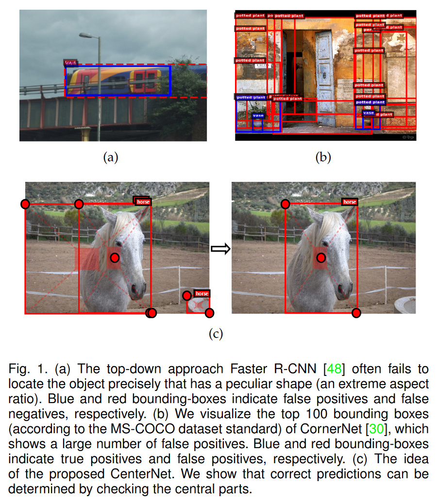
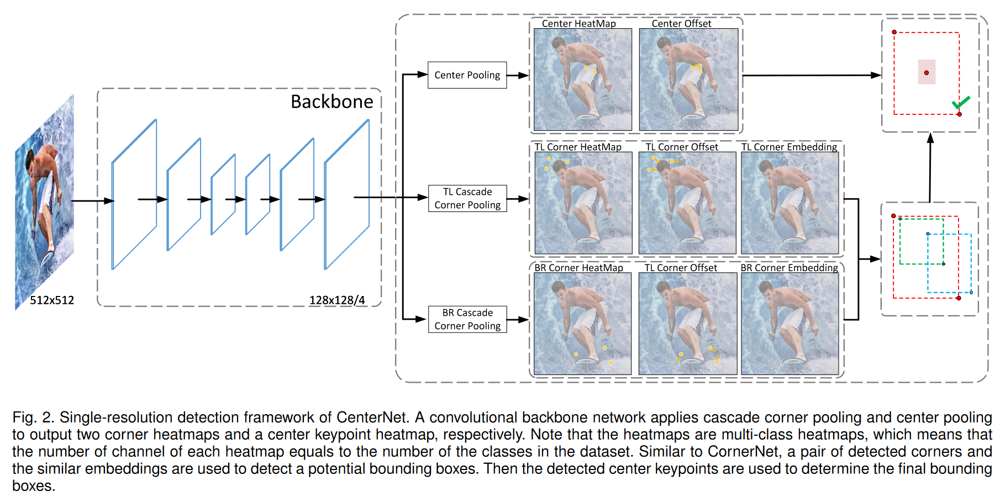
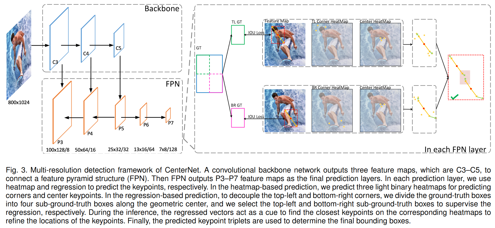
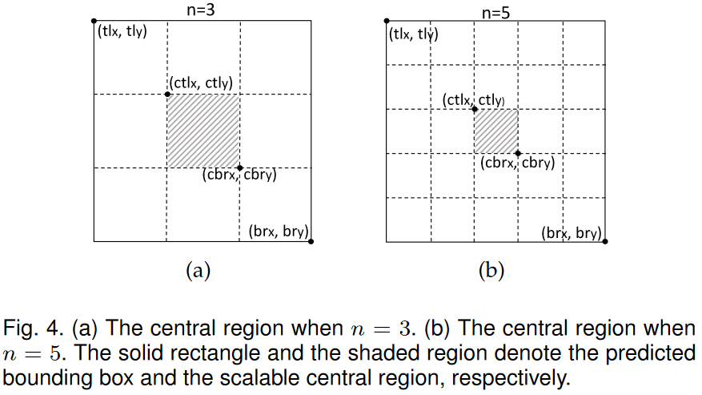
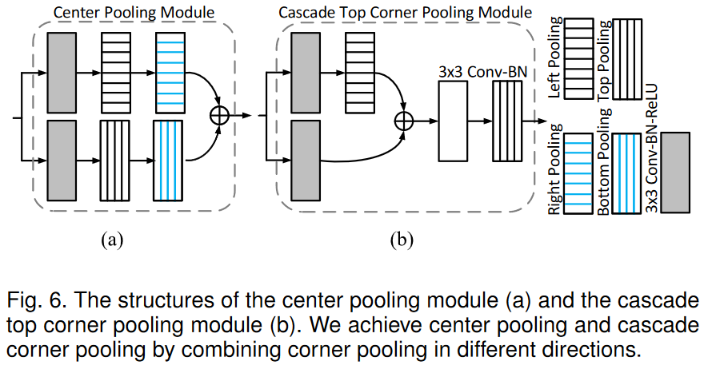

# CenterNet++用于目标检测

原文地址：https://arxiv.org/abs/2204.08394

代码地址：[Duankaiwen/PyCenterNet (github.com)](https://github.com/Duankaiwen/PyCenterNet)

## 摘要

目标检测有两种主流方法：自顶向下和自底向上。目前最先进的方法主要是自顶向下方法。在本文中，作者证明了自底向上方法相较于自顶向下方法表现出竞争力，并且具有更高的召回率。作者的方法名为CenterNet，它将每个目标检测为关键点三元组（左上角、右下角和中心关键点）。首先根据设计的提示对角点进行分组，并根据中心关键点确认目标位置。角点关键点使该方法能够检测不同尺度和形状的目标，而中心关键点减少了大量误报提案带来的混淆。作者的方法是一种无锚检测器，因为它不需要定义显式的锚框。作者将该方法适配于不同结构的骨干网络，包括“沙漏”型网络和“金字塔”型网络，分别在单分辨率和多分辨率特征图中检测目标。在MS-COCO数据集上，使用Res2Net-101和Swin-Transformer的CenterNet分别达到了53.7%和57.1%的平均精度（AP），超越了所有现有的自底向上检测器，并达到了最先进的性能。作者还设计了一种实时的CenterNet模型，在30.5帧每秒（FPS）的速度下达到了43.6%的AP，实现了准确性和速度之间的良好平衡。

## 引言

目前有两种主要的目标检测方法：自底向上方法和自顶向下方法。许多研究人员认为，自底向上方法耗时且引入更多的误报，自顶向下方法因其实践中的有效性逐渐成为主流方法。自顶向下方法将每个目标建模为一个先验点或一个预定义的锚框，并预测到边界框的相应偏移。自顶向下方法可以感知整个目标，从而简化生成边界框的后处理步骤。然而，它们通常难以感知形状特殊的目标（例如，长宽比很大的目标）。图1(a)显示了自顶向下方法无法覆盖“火车”目标的情况。

另一方面，作者发现，自底向上方法在定位任意几何形状的目标方面潜力更大，因此具有更高的召回率。然而，传统的自底向上方法通常会产生许多误报，导致无法准确表示目标。例如，CornerNet作为一种典型的自底向上方法，通过一对角点关键点对每个目标进行建模，并实现了最先进的目标检测精度。然而，CornerNet的性能仍然受到其相对较弱的全局信息感知能力的限制；也就是说，因为每个目标是根据一对角点关键点构建的，算法敏感地检测目标的边界，但并不知道哪些关键点对应该被分组为目标。因此，如图1(b)所示，CornerNet经常生成错误的边界框，其中大多数可以通过一些补充信息（例如长宽比）轻松过滤掉。

通过对自底向上方法的分析，作者的假设是，如果其感知目标全局信息的能力得到提升，自底向上方法在竞争中将不逊色于自顶向下方法。在本文中，作者提出了一种低成本且有效的解决方案，命名为CenterNet，这是一种强大的自底向上目标检测方法，根据关键点三元组（左上角、右下角和中心）检测每个目标。CenterNet相比传统方法，通过额外的关键点探索提案的中心部分，即接近框几何中心的区域。作者的假设是，如果预测边界框与真实框有很高的交并比（IoU），则边界框中央区域的中心关键点被预测为相同类别的概率较高，反之亦然。因此，在推理过程中，当生成提案时，通过验证是否有相同类别的中心关键点落在提案的中央区域来确定该提案是否确实是一个目标。这个概念如图1(c)所示。

作者设计了两种框架以适应不同结构的网络。第一个框架针对“沙漏”型网络开发，这些网络在单分辨率特征图中检测目标。“沙漏”网络在执行关键点估计任务时非常流行，应用这种类型的网络来更好地预测角点和中心关键点。作者还设计了适用于“金字塔”型网络的框架，这些网络在多分辨率特征图中检测目标。这种方法有两个主要优点：更强的通用性，因为大多数网络具有“金字塔”结构，例如ResNet及其变体；更高的检测准确性，因为不同尺度的目标在不同的感受野中被检测到。尽管金字塔结构在自顶向下方法中已被广泛应用，据作者所知，这是首次在自底向上方法中应用。

作者在MS-COCO数据集上评估了提出的CenterNet，这是一个用于大规模目标检测的最流行的基准数据集之一。使用Res2Net-101和Swin-Transformer的CenterNet分别达到了53.7%和57.1%的AP，大幅超越了所有现有的自底向上检测器。还设计了一种实时的CenterNet，在30.5 FPS的速度下达到了43.6%的AP，实现了准确性和速度之间的良好平衡。CenterNet高效且接近现有自顶向下方法的最先进性能。

本文的初步版本已在会议中发表。在这个扩展版本中，作者基于以下几个方面改进了工作。

(i) 原始的CenterNet仅应用于**沙漏网络**作为骨干网络，其中所有目标仅在单分辨率特征图中检测。将CenterNet的思想扩展到具有金字塔结构的网络，从而允许CenterNet在多分辨率特征图中检测目标。为此，提出了新的方法来检测关键点（包括角点和中心关键点）并对关键点进行分组。

(ii) 在这个版本中，由于CenterNet的新设计，研究了更多具有金字塔结构的骨干网络，包括ResNet、ResNext和Res2Net。此外，还报告了使用Transformer作为骨干网络的检测结果。实验结果表明，通过引入金字塔结构，检测准确性显著提高，这使得网络能够使用更丰富的感受野来检测目标。

(iii) 提出了一个实时的CenterNet，在精度/速度权衡方面优于流行的检测器。

本文的主要贡献可以总结如下：

- 提出了一种强大的**自底向上**目标检测方法，名为CenterNet。CenterNet根据关键点三元组检测每个目标，因此可以定位**任意几何形状的目标**并感知目标的全局信息。

- 设计了两种框架以适应不同结构的网络，提高了方法的通用性。因此，该方法适用于几乎所有的网络。

- CenterNet在自底向上方法中实现了最先进的检测精度，并接近现有自顶向下方法的最先进性能。

- 在适当降低结构复杂度的情况下，CenterNet在准确性和速度之间实现了令人满意的权衡。因此，证明了自底向上方法是必要的，并且在与自顶向下方法的竞争中是有竞争力的。

## 方法

图2. CenterNet的**单分辨率**检测框架。一个卷积骨干网络应用级联角点池化和中心池化，分别输出两个角点热图和一个中心关键点热图。注意，这些热图是多类别热图，这意味着每个热图中的通道数等于数据集中的类别数。类似于CornerNet，检测到的一对角点和相似的嵌入用于检测潜在的边界框。然后，检测到的中心关键点用于确定最终的边界框。

图3. CenterNet的**多分辨率**检测框架。一个卷积骨干网络输出三个特征图，分别标记为C3-C5，并输入到特征金字塔网络（FPN）中。然后，FPN输出P3-P7特征图作为最终的预测层。在每个预测层中，使用热图和回归来预测关键点。在基于热图的预测方法中，预测三个轻量的二值热图来预测角点和中心关键点。在基于回归的预测方法中，为了解耦左上角和右下角，沿几何中心将真实框分成四个子真实框，并选择左上角和右下角子真实框来监督回归过程。在推理过程中，回归向量作为提示来识别相应热图中最接近的关键点，以优化关键点位置。最后，预测的关键点三元组用于确定最终的边界框。

图4. (a) 当n=3时的中央区域。(b) 当n=5时的中央区域。实线矩形和阴影区域分别表示预测的边界框和可伸缩的中央区域。

图6. 中心池化模块(a)和级联顶角池化模块(b)的结构。通过结合不同方向的角点池化来实现中心池化和级联角点池化。

## 结论

在本文中，作者提出了CenterNet，一种新的自底向上目标检测方法，它使用一组关键点来检测目标，包括一个中心关键点和两个角点。作者的方法解决了传统自底向上方法缺乏对裁剪区域的额外调查的问题，通过以最小成本探索每个提议区域内的视觉模式来解决这个问题。此外，**基于金字塔结构的框架扩展了CenterNet，以提高多尺度目标检测性能**。实验结果表明，CenterNet在大幅超越所有现有的自底向上方法的同时，与最先进的自顶向下方法相比具有竞争力，尤其是在召回率方面。还设计了一些实时的CenterNet模型，它们在准确性和速度之间取得了良好的平衡。重要的是，证明了自底向上方法在定位任意几何形状的目标时比自顶向下方法更灵活，并且对每个提议区域进行额外调查是提高模型精度的必要条件。作者希望CenterNet能够吸引更多关注，并促进对自底向上方法的进一步探索。