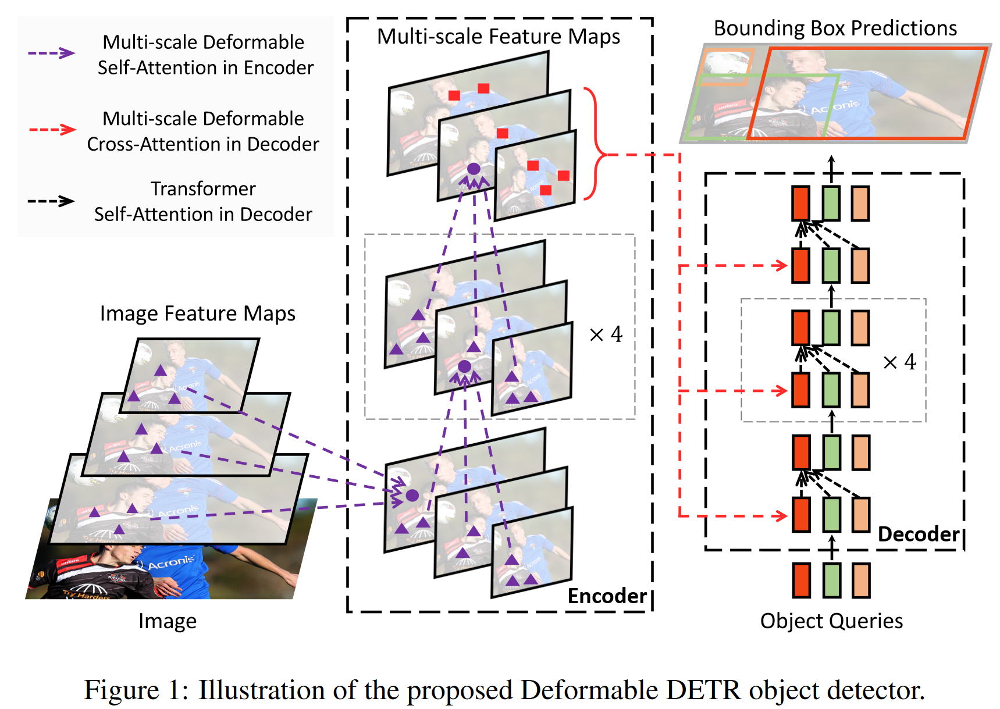
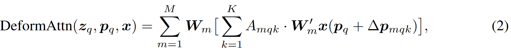
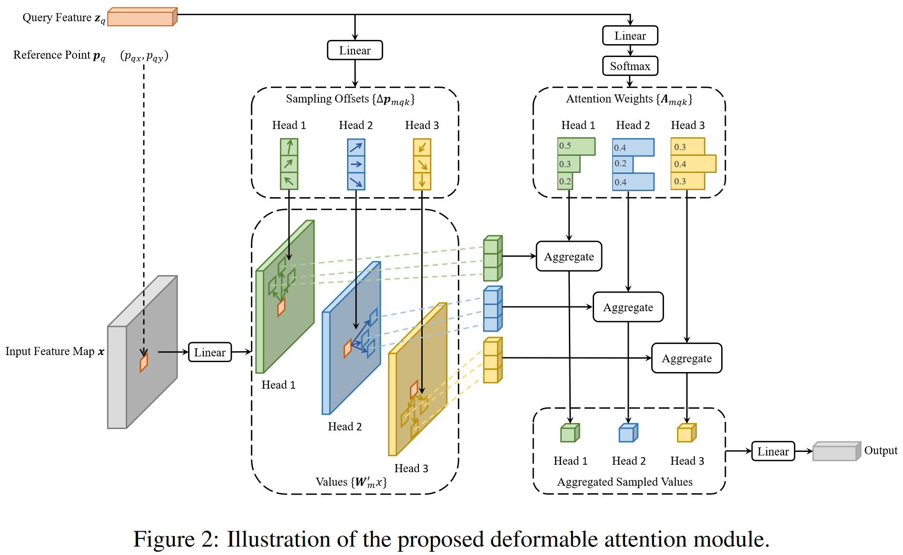
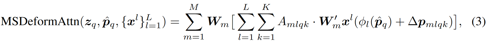

# DEFORMABLE DETR: DEFORMABLE TRANSFORMERS FOR END-TO-END OBJECT DETECTION

代码：https://github.com/fundamentalvision/Deformable-DETR

## 摘要

最近提出的DETR旨在消除目标检测中许多手工设计的组件，同时表现出良好的性能。然而，由于Transformer注意力模块在处理图像特征图时的限制，它存在收敛速度慢和特征空间分辨率有限的问题。为了解决这些问题，我们提出了Deformable DETR，其注意力模块仅关注参考点周围的一小部分**关键采样点**。Deformable DETR可以在训练时间减少10倍的情况下，实现比DETR更好的性能（尤其是在**小目标**上的表现）。在COCO基准上的大量实验证明了我们方法的有效性。


对于输入图片，首先经过Multi-scale Deformable self-Attention选取特征点，并做特征映射，生成向量，对于位置编码，有两种，一种是在相对位置编码加上绝对level级别编码，另外一种是加入可学习的level编码。然后输入decoder中，对于decoder，首先初始化300个初始化向量，经过self-Attention的处理，然后与ecoder特征做注意力运算，最后做预测。




## 方法

**Deformable Attention Module**



$∆_{mqk}和A_{mqk}$分别表示第m个注意力头中第k个采样点的采样偏移量和注意力权重



**Multi-scale Deformable Attention Module**



### 4.2 额外改进和变体

**Iterative Bounding Box Refinement**  建立了一种简单有效的迭代边界框细化机制，以提高检测性能。在这里，每个解码器层根据上一层的预测来细化边界框。        

**Two-Stage Deformable DETR**  在原始的DETR中，解码器中的对象查询与当前图像无关。受两阶段目标探测器的启发，我们探索了可变形DETR的一种变体，用于生成区域建议作为第一阶段。生成的区域建议将被输入解码器作为对象查询以进一步细化，形成一个两阶段可变形的DETR。
    在第一阶段，为了实现高召回率的建议，多尺度特征图中的每个像素都将作为一个对象查询。然而，直接将对象查询设置为像素会给解码器中的自注意模块带来不可接受的计算和内存成本，其复杂度随着查询的数量呈二次增长。为了避免这个问题，我们去掉了解码器，并形成了一个仅限编码器的可变形的DETR，用于区域提案的生成。在它中，每个像素被分配为一个对象查询，它直接预测一个边界框。得分最高的边界框被选为区域提案。在将区域提案提交到第二阶段之前，不应用NMS。

## 代码


`models/ops/modules/ms_deform_attn.py`

```python
class MSDeformAttn(nn.Module):
    def __init__(self, d_model=256, n_levels=4, n_heads=8, n_points=4):
        """
        Multi-Scale Deformable Attention Module
        :param d_model      hidden dimension
        :param n_levels     number of feature levels
        :param n_heads      number of attention heads
        :param n_points     number of sampling points per attention head per feature level
        """
        super().__init__()
        if d_model % n_heads != 0:
            raise ValueError('d_model must be divisible by n_heads, but got {} and {}'.format(d_model, n_heads))
        _d_per_head = d_model // n_heads
        # you'd better set _d_per_head to a power of 2 which is more efficient in our CUDA implementation
        if not _is_power_of_2(_d_per_head):
            warnings.warn("You'd better set d_model in MSDeformAttn to make the dimension of each attention head a power of 2 "
                          "which is more efficient in our CUDA implementation.")

        self.im2col_step = 64

        self.d_model = d_model
        self.n_levels = n_levels
        self.n_heads = n_heads
        self.n_points = n_points

        self.sampling_offsets = nn.Linear(d_model, n_heads * n_levels * n_points * 2)
        self.attention_weights = nn.Linear(d_model, n_heads * n_levels * n_points)
        self.value_proj = nn.Linear(d_model, d_model)
        self.output_proj = nn.Linear(d_model, d_model)

        self._reset_parameters()

    def _reset_parameters(self):
        constant_(self.sampling_offsets.weight.data, 0.)
        thetas = torch.arange(self.n_heads, dtype=torch.float32) * (2.0 * math.pi / self.n_heads)
        grid_init = torch.stack([thetas.cos(), thetas.sin()], -1)
        grid_init = (grid_init / grid_init.abs().max(-1, keepdim=True)[0]).view(self.n_heads, 1, 1, 2).repeat(1, self.n_levels, self.n_points, 1)
        for i in range(self.n_points):
            grid_init[:, :, i, :] *= i + 1
        with torch.no_grad():
            self.sampling_offsets.bias = nn.Parameter(grid_init.view(-1))
        constant_(self.attention_weights.weight.data, 0.)
        constant_(self.attention_weights.bias.data, 0.)
        xavier_uniform_(self.value_proj.weight.data)
        constant_(self.value_proj.bias.data, 0.)
        xavier_uniform_(self.output_proj.weight.data)
        constant_(self.output_proj.bias.data, 0.)

    def forward(self, query, reference_points, input_flatten, input_spatial_shapes, input_level_start_index, input_padding_mask=None):
        """
        :param query                       (N, Length_{query}, C)
        :param reference_points            (N, Length_{query}, n_levels, 2), range in [0, 1], top-left (0,0), bottom-right (1, 1), including padding area
                                        or (N, Length_{query}, n_levels, 4), add additional (w, h) to form reference boxes
        :param input_flatten               (N, \sum_{l=0}^{L-1} H_l \cdot W_l, C)
        :param input_spatial_shapes        (n_levels, 2), [(H_0, W_0), (H_1, W_1), ..., (H_{L-1}, W_{L-1})]
        :param input_level_start_index     (n_levels, ), [0, H_0*W_0, H_0*W_0+H_1*W_1, H_0*W_0+H_1*W_1+H_2*W_2, ..., H_0*W_0+H_1*W_1+...+H_{L-1}*W_{L-1}]
        :param input_padding_mask          (N, \sum_{l=0}^{L-1} H_l \cdot W_l), True for padding elements, False for non-padding elements

        :return output                     (N, Length_{query}, C)
        """
        N, Len_q, _ = query.shape
        N, Len_in, _ = input_flatten.shape
        assert (input_spatial_shapes[:, 0] * input_spatial_shapes[:, 1]).sum() == Len_in

        value = self.value_proj(input_flatten)
        if input_padding_mask is not None:
            value = value.masked_fill(input_padding_mask[..., None], float(0))
        value = value.view(N, Len_in, self.n_heads, self.d_model // self.n_heads)
        sampling_offsets = self.sampling_offsets(query).view(N, Len_q, self.n_heads, self.n_levels, self.n_points, 2)
        attention_weights = self.attention_weights(query).view(N, Len_q, self.n_heads, self.n_levels * self.n_points)
        attention_weights = F.softmax(attention_weights, -1).view(N, Len_q, self.n_heads, self.n_levels, self.n_points)
        # N, Len_q, n_heads, n_levels, n_points, 2
        if reference_points.shape[-1] == 2:
            offset_normalizer = torch.stack([input_spatial_shapes[..., 1], input_spatial_shapes[..., 0]], -1)
            sampling_locations = reference_points[:, :, None, :, None, :] \
                                 + sampling_offsets / offset_normalizer[None, None, None, :, None, :]
        elif reference_points.shape[-1] == 4:
            sampling_locations = reference_points[:, :, None, :, None, :2] \
                                 + sampling_offsets / self.n_points * reference_points[:, :, None, :, None, 2:] * 0.5
        else:
            raise ValueError(
                'Last dim of reference_points must be 2 or 4, but get {} instead.'.format(reference_points.shape[-1]))
        output = MSDeformAttnFunction.apply(
            value, input_spatial_shapes, input_level_start_index, sampling_locations, attention_weights, self.im2col_step)
        output = self.output_proj(output)
        return output
```

