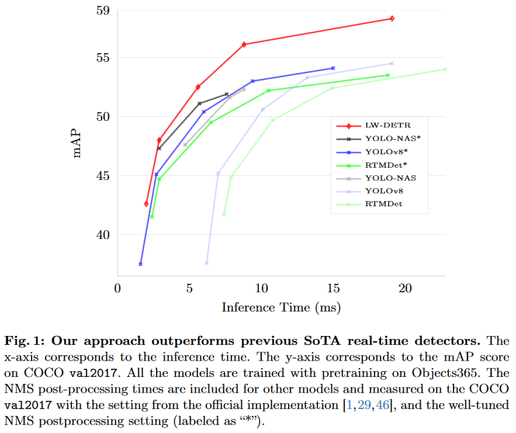
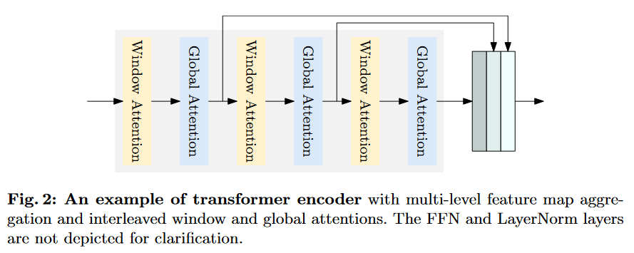
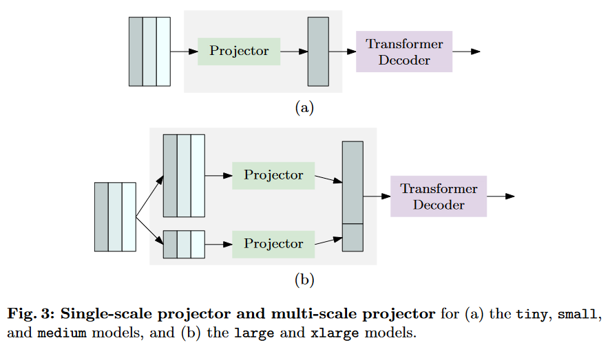
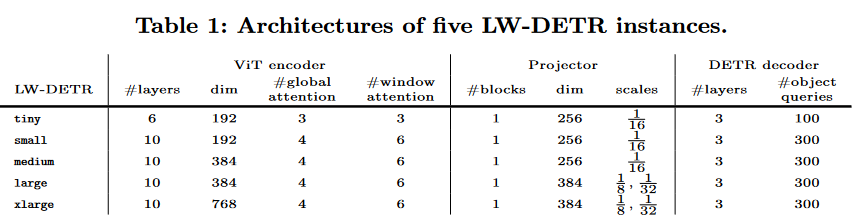
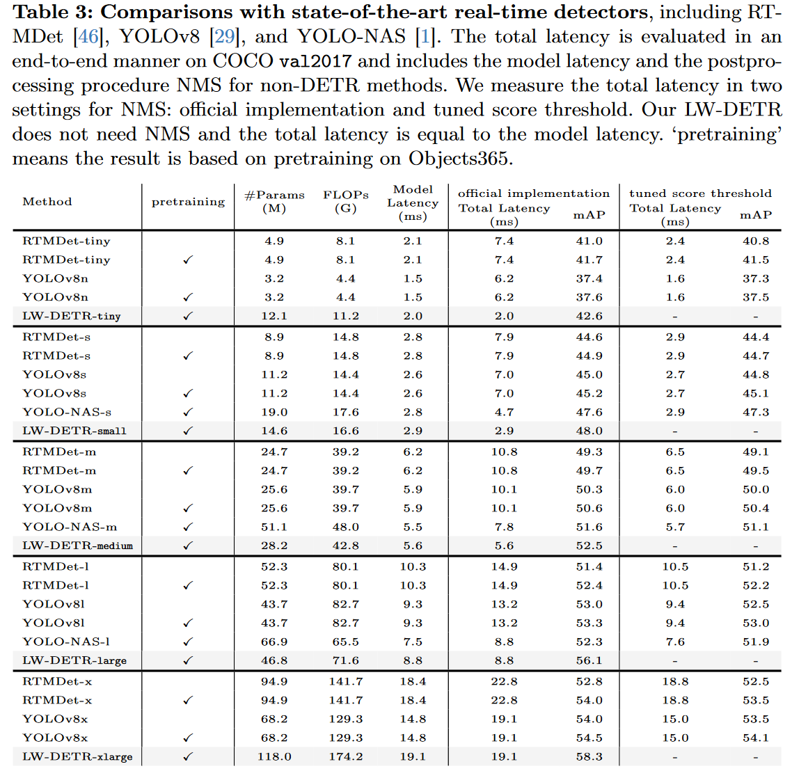
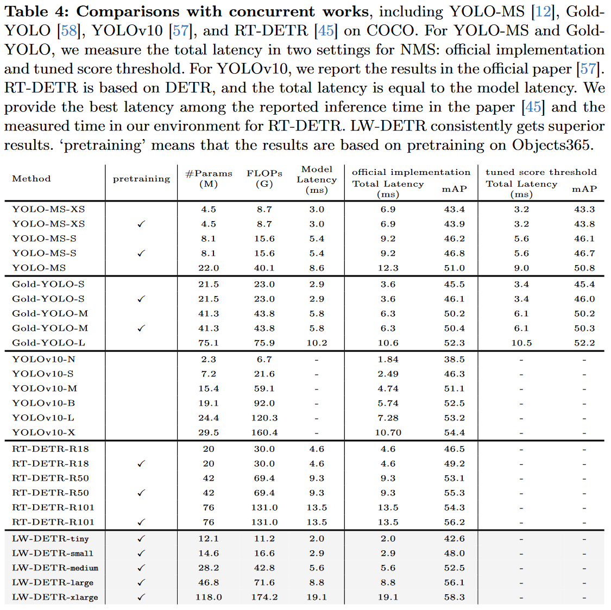
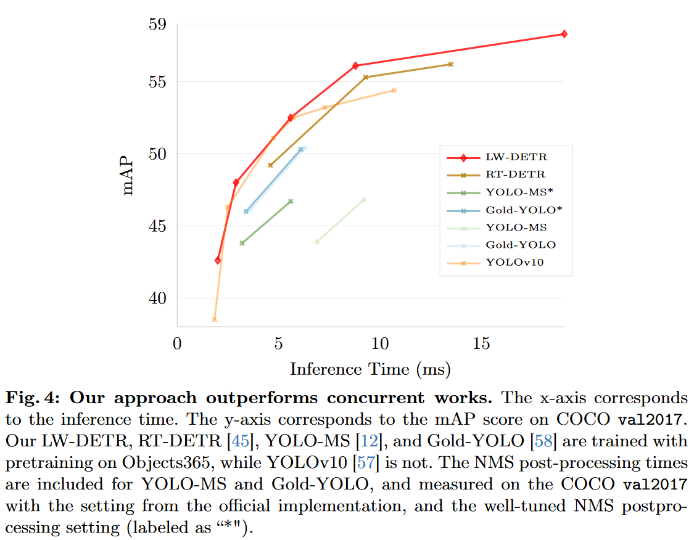

# LW-DETR: A Transformer Replacement to YOLO for Real-Time Detection

论文地址：https://arxiv.org/abs/2406.03459

代码地址：

## 摘要

在本文中，我们提出了一种轻量级的detection transformer，LW-DETR，它在实时对象检测方面优于YOLOs。该架构是一个简单的ViT编码器、投影仪和浅层DETR解码器的堆栈。我们的方法利用了最近的先进技术，例如训练有效的技术，例如改进的损失和预训练，以及交错窗口和全局关注，以降低ViT编码器的复杂性。我们通过聚合多级特征图以及ViT编码器中的中间和最终特征图来改进ViT编码器，形成更丰富的特征图，并引入窗口主特征图组织，以提高交错注意力计算的效率。实验结果表明，在COCO和其他基准数据集上，所提出的方法优于现有的实时检测器，例如YOLO及其变体。

## 引言

图1显示，所提出的简单基线在COCO数据集上的性能出乎意料地超过了先前的实时检测器，例如YOLO-NAS、YOLOv8和RTMDet。这些模型在Objects365数据集上进行了预训练，并使用官方实现的设置测量了包括NMS时间在内的端到端时间成本。

## LW-DETR

### 架构

LW-DETR包括一个ViT编码器、一个投影器和一个DETR解码器。

**编码器**。我们采用ViT作为检测编码器。一个简单的ViT包含一个块化层（patchification layer）和多个Transformer编码器层。在最初的ViT中，一个Transformer编码器层包含对所有标记（tokens）的全局自注意力层和一个前馈网络（FFN）层。全局自注意力在计算上成本较高，其时间复杂度与标记（块）的数量呈二次方关系。我们实现了一些**具有窗口自注意力的Transformer编码器层**，以降低计算复杂度。我们提出将编码器中的多级特征图（中间和最终特征图）进行聚合，形成更强大的编码特征图。编码器的一个示例如图2所示。

**解码器**。解码器是由多个Transformer解码器层堆叠而成的。每一层包括一个自注意力层、一个交叉注意力层和一个前馈网络（FFN）。为了计算效率，我们采用了**可变形交叉注意力**。DETR及其变体通常采用6个解码器层。在我们的实现中，我们使用了**3个Transformer解码器层**。这导致时间从1.4毫秒减少到0.7毫秒，这对于我们方法中微小版本剩余部分的1.3毫秒时间成本来说是一个显著的改进。

我们采用了一种**混合查询选择方案**来形成目标查询，作为内容查询和空间查询的加和。内容查询是可学习的嵌入，类似于DETR。空间查询基于两阶段方案：从投影器最后一层选择前K个特征，预测边界框，并将相应的框转换为嵌入作为空间查询。

**投影器**。我们使用一个投影器来**连接编码器和解码器**。投影器以编码器中的聚合编码特征图作为输入。投影器是一个**C2f块（跨阶段部分DenseNet的扩展）**，在YOLOv8中实现。

在形成LW-DETR的大型和特大型版本时，我们修改了投影器以输出两尺度（1/8和1/32）的特征图，并相应地使用了多尺度解码器。投影器包含两个并行的C2f块。一个处理1/8的特征图，这些特征图是通过反卷积对输入进行上采样得到的；另一个处理1/32的特征图，这些特征图是通过步长卷积对输入进行下采样得到的。图3展示了单尺度投影器和多尺度投影器的流程。

### 实例化

我们实例化了5个实时检测器：tiny、small、medium、large和xlarge。详细的设置如表1所示。

1. tiny检测器包含一个具有6层的Transformer编码器。每一层包含一个多头自注意力模块和一个前馈网络（FFN）。每个图像块被线性映射到一个192维的表示向量，投影器输出具有256个通道的单尺度特征图，解码器有100个对象查询。

2. small检测器包含10个编码器层，以及300个对象查询。与tiny检测器相同，输入块表示和投影器输出的维度分别为192和256。

3. medium检测器与small检测器类似，不同之处在于输入块表示的维度为384，因此编码器的维度也相应为384。

4. large检测器包含一个10层的编码器，并使用两尺度特征图。输入块表示和投影器输出的维度均为384。

5. xlarge检测器与large检测器类似，不同之处在于输入块表示的维度为768。

## 实验

### 结果

我们五个LW-DETR模型的结果在表3中进行了报告。LW-DETRtiny在T4 GPU上以500 FPS的速度达到了42.6 mAP。LW-DETR-small和LW-DETR-medium分别以超过340 FPS和超过178 FPS的速度分别达到了48.0 mAP和52.5 mAP。大型和特大型模型分别以113 FPS和52 FPS的速度达到了56.1 mAP和58.3 mAP。

**与最先进的实时检测器的比较**。在表3中，我们报告了LW-DETR模型与具有代表性的实时检测器的比较，包括YOLO-NAS、YOLOv8和RTMDet。可以看出，无论是否使用预训练，LW-DETR始终优于先前的最佳实时检测器。我们的LW-DETR在延迟和检测性能方面，从小型到特大型五个尺度上均明显优于YOLOv8和RTMDet。

与先前最好的方法YOLO-NAS相比，YOLO-NAS是通过神经架构搜索获得的，我们的LW-DETR模型在小型和中型尺度上分别比它高出0.4 mAP和0.9 mAP，并且运行速度分别是它的1.6倍和约1.4倍。当模型变大时，改进变得更加显著：在大型尺度上以相同的速度运行时，提高了3.8 mAP。

我们通过精心调整NMS过程中的分类得分阈值来进一步改进其他方法，这些结果得到了显著改善，但仍然低于我们的LW-DETR。我们期望我们的方法可能受益于其他改进，如神经网络架构搜索（NAS）、数据增强、伪标签数据和知识蒸馏等，这些改进已被先前的实时检测器所利用。

**与并发工作的比较**。我们将LW-DETR与实时检测中的并发工作进行了比较，包括YOLO-MS、Gold-YOLO、RTDETR和YOLOv10。YOLO-MS通过增强多尺度特征表示来提高性能。Gold-YOLO通过增强多尺度特征融合和应用MAE风格的预训练来提高YOLO性能。YOLOv10设计了几种效率和准确性驱动的模块来提高性能。RT-DETR与LW-DETR密切相关，也是基于DETR框架构建的，但在骨干网络、投影器、解码器和训练方案等方面与我们的方法存在许多差异。

比较结果如表4和图4所示。我们的LW-DETR在检测性能和延迟之间始终取得了更好的平衡。YOLO-MS和Gold-YOLO在所有模型尺度上都明显表现出比我们的LW-DETR更差的结果。LW-DETR-large在性能上比密切相关的RT-DETR-R50高出0.8 mAP，并显示出更快的速度（8.8 ms vs. 9.9 ms）。具有其他尺度的LW-DETR也显示出比RT-DETR更好的结果。与最新工作YOLOv10-X相比，我们的LW-DETR-large以更低的延迟（8.8 ms vs. 10.70 ms）实现了更高的性能（56.1 mAP vs. 54.4 mAP）。

## 局限和未来工作

目前，我们仅展示了LW-DETR在实时检测中的有效性。这只是第一步。将LW-DETR扩展到开放世界检测，以及将LW-DETR应用于更多视觉任务，如多人姿态估计和多视图3D目标检测，还需要更多的研究。我们将这些留作未来的工作。

## 总结

本文表明，检测Transformer在实时检测方面取得了与现有实时检测器相竞争甚至更优的结果。我们的方法简单且高效。其成功源于**多级特征聚合以及训练和推理高效的技术**。我们希望我们的经验能为在视觉任务中使用Transformer构建实时模型提供见解。