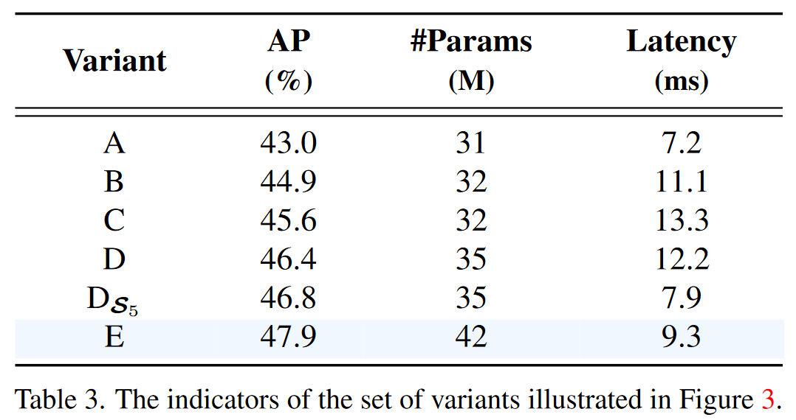

# DETRs Beat YOLOs on Real-time Object Detection

> 我们没有必要去追求什么所谓的“纯粹血统”，没有必要去搭建一个百分百的Transformer结构的通用目标检测器，因为Transformer的魅力并不在此，如果只关注目标检测等单一的视觉任务，它未必有显著优于CNN架构的优势。这些年也出现了大量为CNN正名的工作。

前置知识：Deformable-DETR、DINO

## 4. The Real-time DETR

骨干网络：ResNet

图4。RT-DETR总览 .我们将骨干网最后三个阶段的特征输入到编码器中。高效的混合编码器通过注意力尺度内特征交互( AIFI )和基于CNN的跨尺度特征融合( CCFF )将多尺度特征转化为图像特征序列。然后，不确定性最小查询选择选择固定数量的编码器特征作为解码器的初始对象查询。最后，带有辅助预测头的解码器迭代优化对象查询生成类别和框。

### 4.2 混合编码器

#### AIFI（Attention-based Intra-scale Feature Interaction）	

- 1个Transformer层，只处理主干网络输出的 S5 特征

#### CCFF（CNNbased Cross-scale Feature Fusion）

- 3个RepBlock

首先，我们将二维的S5 特征拉成向量，然后交给AIFI模块处理，其数学过程就是多头自注意力与FFN，随后，我们再将输出调整回二维，记作 F5 ，以便去完成后续的所谓的“跨尺度特征融合”。之所以RT-DETR的AIFI只处理最后的S5 特征，是出于两点考虑：

1. 一方面，以往的DETR，如Deformable DETR是将多尺度的特征展平成序列（ $\mathbb{R}^{B\times C\times H\times W}→\mathbb{R}^{B\times N\times C}​$ ），然后拼接到一起，构成一个序列很长的向量，随后再交给核心为self attention技术的Transformer encoder去做多尺度之间的特征交互，但这无疑会造成巨大的计算资源的消耗，毕竟self attention技术的平方计算复杂度一直是其广受诟病的缺陷之一；
2. 另一方面，RT-DETR认为相较于较浅的S3 特征和S4 特征，S5 特征拥有更深、更高级、更丰富的语义特征，而self attention机制可能更关注特征的语义性，而非空间局部细节等，因此，作者团队认为不必让多尺度特征都放到一个篮子中去。

综上，作者团队认为只需将Encoder作用在**空间尺寸不太大，信息语义程度有很高的S5 特征**上即可，以此来平衡性能和速度——既可以大幅度地减小计算量、提高计算速度，又不会损伤到模型的性能。为了验证这一点，作者团队设计了若干对照组，如图3所示。

**对于对照组(a)**，其结构就是DINO-R50，但移除了DINO-R50中的多尺度encoder，直接将S3 、 S4 和 S5拼接在一起，交给后续的网络去处理，得到最终的输出。注意，这里的拼接是先将二维的 H×W 拉平成 HW ，然后再去拼接： H1W1+H2W2+H3W3 。

**对于对照组(b)**，作者团队在(a)基础上，加入了**单尺度的Transformer Encoder（SSE）**，仅包含一层Encoder层，分别处理三个尺度的输出，注意，三个尺度共享一个SSE，而不是为每一个尺度都设计一个独立的SSE。通过这一共享的操作，三个尺度的信息是可以实现一定程度的信息交互。最后将处理结果拼接在一起，交给后续的网络去处理，得到最终的输出。

**对于对照组(c)**，作者团队使用**多尺度的Transformer Encoder（MSE）**，大概是Deformable DETR所采用的那一类MSE结构。将三个尺度的特征拼接在一起后，交由MSE来做处理，使得三个尺度的特征同时完成“尺度内”和“跨尺度”的信息交互和融合，最后将处理结果，交给后续的网络去处理，得到最终的输出。

**对于对照组(d)**，作者团队则先用共享的SSE分别处理每个尺度的特征，然后再使用PAN-like的特征金字塔网络去融合三个尺度的特征，最后将融合后的多尺度特征拼接在一起，交给后续的网络去处理，得到最终的输出。

**对于对照组(e)**，作者团队则使用一个SSE只处理 S5 特征，即所谓的**AIFI模块**，随后再使用**CCFM模块**去完成跨尺度的特征融合，最后将融合后的多尺度特征拼接在一起，交给后续的网络去处理，得到最终的输出。

## 5. 实验

### 5.2 混合编码消融实验

