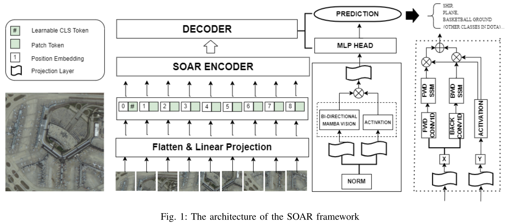

# SOAR:利用状态空间模型和可编程梯度进行航空图像小物体检测的进展

论文地址：https://arxiv.org/pdf/2405.01699

代码地址：

## 摘要

航空图像中的小物体检测在计算机视觉中提出了重大挑战，因为小物体固有的数据最小，而且它们容易被大物体和背景噪声掩盖。传统的使用**基于转换器的模型**的方法往往由于缺乏专门的数据库而面临限制，这将对它们使用不同方向和尺度的对象的性能产生不利影响。这强调了对适应性更强、更轻量级的模型的需求。为此，本文介绍了两种创新的方法，显著提高了对小空中物体的检测和分割能力。首先，我们探讨了在新引入的轻量级**YOLO v9架构上使用SAHI框架**的方法，该架构利用**可编程梯度信息（PGI）**来减少在顺序特征提取过程中通常遇到的大量信息损失。本文采用**视觉Mamba模型**，结合位置嵌入来实现精确的位置感知视觉理解，并结合一种新的双向状态空间模型（SSM）来实现有效的视觉上下文建模。该状态空间模型巧妙地利用了中枢神经网络的线性复杂性和变压器的全局接受域，使其在遥感图像分类中特别有效。我们的实验结果表明，在检测精度和处理效率方面有了显著的提高，验证了这些方法在不同空中场景下的实时小目标检测中的适用性。本文还讨论了这些方法如何可以作为空中物体识别技术未来发展的基础模型。

## 引言

贡献总览

- YOLOv9，一种新型的空中图像平台，被部署在DOTA上。它通过将切片辅助超推断管道适配器与预训练机制相结合，改进了之前的工作。
- 一个新的框架，动态小体目标检测和实验验证使用SOAR超过视觉Mamba架构。
- 提出了一种新的框架，以融合可编程梯度信息与状态空间模型表示，以有效的视觉和计算机视觉任务设置。

## 方法

### A. SSM

### B. 可编程梯度信息

### C. 总体架构：

## 结论和展望

这些发现证明了这些轻量级和适应性强的模型作为空中物体识别和其他复杂视觉任务未来进展的基础技术的潜力。随着我们继续改进这些方法，它们有望显著影响计算机视觉的发展，特别是在资源有限的场景中。