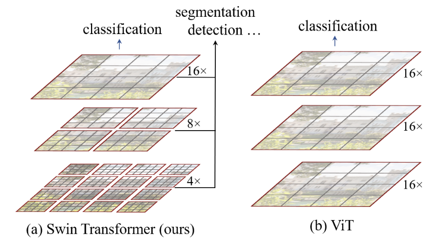
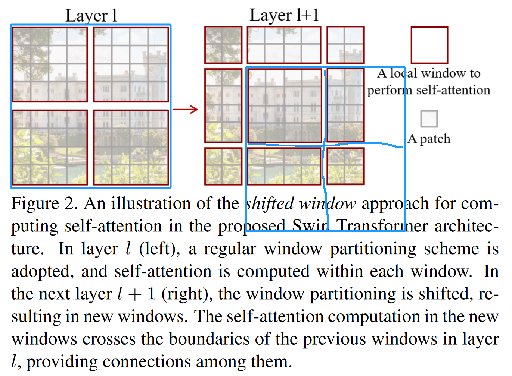
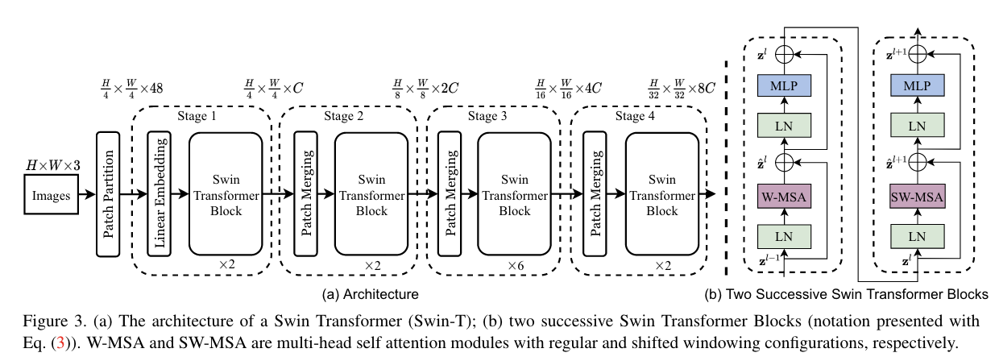
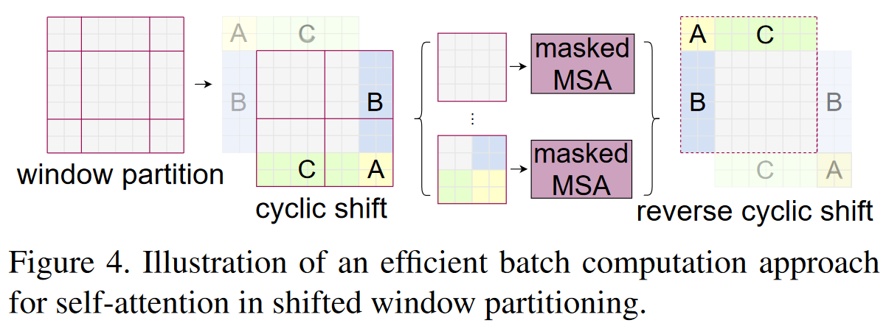
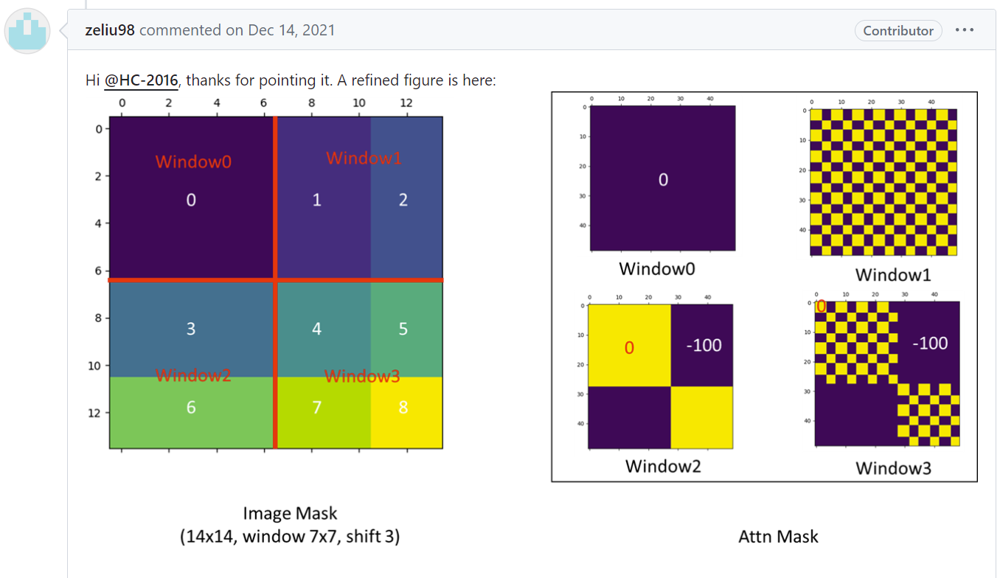
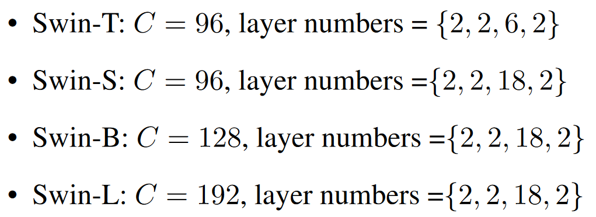

# Swin Transformer：使用移动窗口的层级式的 Vision Transformer

“披着Transformer皮的卷积神经网络”

论文地址：

代码地址：https://github.com/microsoft/Swin-Transformer

笔记参考连接：https://www.bilibili.com/video/BV13L4y1475U

## 摘要

Swin Transformer 可以作为计算机视觉的通用 backbone。

直接把 Transformer 从 NLP 用到 Vision 是有一些挑战的，这个挑战主要来自于两个方面：

一个就是**视觉尺度变化大**的问题

另外一个挑战是**图像的分辨率太大**

基于这两个挑战，作者就提出了**包含滑窗操作、具有层级结构**的 Swin Transformer，它的特征是通过一种叫做移动窗口的方式学来的。

使用移动窗口能够提高效率，因为在 Vit 当中，注意力是全局计算的，而现在注意力是在窗口内算的，所以序列的长度会大大降低，所以说移动窗口提高了效率。

因为 Swin Transformer 拥有了像卷积神经网络一样分层的结构，有了这种多尺度的特征，所以它很容易使用到下游任务里，所以在这篇论文里，作者不光是在 ImageNet-1K 上做了实验，而且达到了非常好的准确度87.3；而且还在密集预测型的任务上，比如说物体检测、物体分割上取得了很好的成绩，比如说在 COCO 上刷到58.7的 AP，比之前最好的方法高了2.7个点；然后在语义分割上，ADE上 也刷到了53.5，比之前最好的方法高了3.2个点。因为 Swin Transformer 大概都提了3个点，提升是相当显著的，这种基于 Transformer 的模型作为视觉领域的骨干网络是非常有潜力的。

## 引言

CNN具有多尺度特征，主要是因为有Pooling（池化）这个操作，池化操作能够增大每一个卷积核能看到的感受野，从而使得每次池化后的的特征抓住物体的不同尺寸。

Swin Transformer也提出类似于池化的操作，叫做**patch merging**，就是把相邻的小patch合成一个大patch，合成出来的大patch就能看到之前四个小patch看到的内容，感受野就增大了，同时也能抓住多尺度特征



灰色的小patch是最基本的元素单元，也就是4 * 4的那个patch，每个红色的框是一个中型的计算单元，也就是一个窗口，一个小窗口里面默认有7 * 7 = 49个小patch



## 3. 方法

### 3.1 整体架构

 `Patch Partition` 和 `Linear Embedding` 相当于ViT里的Patch Projection操作，在代码里用一次卷积操作就完成

Block

patch merging：

- 类似于CNN中的池化操作

- 像yolo里的Focus层？



整个模型采取层次化的设计，一共包含4个 stage，并且每个 stage 都会**缩小输入特征图的分辨率**，像 CNN 那样逐层的**扩大感受野**，描述如下：

- 首先输入图片大小为$H \times W \times 3$，会先通过一个 `Patch Partition` 层，它的作用是将输入图片进行分块处理，即每相邻的像素为一个 Patch，然后再在 channel 方向上进行 flatten，维度变为$\frac{H}{4} \times \frac{W}{4} \times 48$。
- 然后在进入 stage1 的 block 前，会先经过一个 `Linear Embedding` 层对每个像素的 channel 数据做线性变换，维度变为$\frac{H}{4} \times \frac{W}{4} \times C$在源码中，Patch Partition 和 Linear Embedding 直接通过一个卷积层来实现，和 ViT 是一样的。值得注意这也是 stage1 不同于其它的 stage 的地方，其它 stage 的第一个模块都是 `Patch Merging` 层。
- 利用4个 stage 构建不同大小的特征图，即通过不同的 stage 对特征图进行下采样，这里需要注意，每下采样2倍的时候，channel 需要进行一个翻倍的操作。
- 然后在每个 stage 中都会重复堆叠 block，它的 block 有两种结构，图(b)所示，这两种结构的不同之处在于一个使用了 **W-MSA** 结构，一个使用了 **SW-MSA** 结构，并且堆叠的次数都偶数的，也就是这两种结构是成对使用的，即先使用左边的 W-MSA，然后再使用右边的 SW-MSA。
- 最后对于分类网络，后面还会接上一个Layer Norm层、全局池化层以及全连接层得到最终输出。图中没有画，但源码中是这样做的。

### 3.2 基于移动窗口的自注意力

原来的图片会被平均的分成一些没有重叠的窗口，每一个小窗口里还有$M  \times M​$ 个patch，一般M默认为7，所有的自注意力的计算都是在这些小窗口里完成的，序列长度永远都是7 * 7 = 49。

先做一次基于窗口的多头自注意力，然后再做一次基于移动窗口的多头自注意力，这样就达到了窗口和窗口之间的互相通信，始终都需要两层block连在一起作为一个基本单元。

提高性能的技术细节：

- 提高移动窗口的计算效率：循环移位   masking掩码的方式  还原循环移位

  

  掩码

  

- 相对位置编码

### 3.3 变体



## 代码

> ### Patch Embedding

```python
class PatchEmbed(nn.Module):
    r""" Image to Patch Embedding

    Args:
        img_size (int): Image size.  Default: 224.
        patch_size (int): Patch token size. Default: 4.
        in_chans (int): Number of input image channels. Default: 3.
        embed_dim (int): Number of linear projection output channels. Default: 96.
        norm_layer (nn.Module, optional): Normalization layer. Default: None
    """

    def __init__(self, img_size=224, patch_size=4, in_chans=3, embed_dim=96, norm_layer=None):
        super().__init__()
        img_size = to_2tuple(img_size)
        patch_size = to_2tuple(patch_size)
        patches_resolution = [img_size[0] // patch_size[0], img_size[1] // patch_size[1]]
        self.img_size = img_size
        self.patch_size = patch_size
        self.patches_resolution = patches_resolution
        self.num_patches = patches_resolution[0] * patches_resolution[1]

        self.in_chans = in_chans
        self.embed_dim = embed_dim

        self.proj = nn.Conv2d(in_chans, embed_dim, kernel_size=patch_size, stride=patch_size)
        if norm_layer is not None:
            self.norm = norm_layer(embed_dim)
        else:
            self.norm = None
```

> ### Patch Merging

```python
class PatchMerging(nn.Module):
    r""" Patch Merging Layer.

    Args:
        input_resolution (tuple[int]): Resolution of input feature.
        dim (int): Number of input channels.
        norm_layer (nn.Module, optional): Normalization layer.  Default: nn.LayerNorm
    """

    def __init__(self, input_resolution, dim, norm_layer=nn.LayerNorm):
        super().__init__()
        self.input_resolution = input_resolution
        self.dim = dim
        self.reduction = nn.Linear(4 * dim, 2 * dim, bias=False)
        self.norm = norm_layer(4 * dim)

    def forward(self, x):
        """
        x: B, H*W, C
        """
        H, W = self.input_resolution
        B, L, C = x.shape
        assert L == H * W, "input feature has wrong size"
        assert H % 2 == 0 and W % 2 == 0, f"x size ({H}*{W}) are not even."

        x = x.view(B, H, W, C)

        x0 = x[:, 0::2, 0::2, :]  # B H/2 W/2 C
        x1 = x[:, 1::2, 0::2, :]  # B H/2 W/2 C
        x2 = x[:, 0::2, 1::2, :]  # B H/2 W/2 C
        x3 = x[:, 1::2, 1::2, :]  # B H/2 W/2 C
        x = torch.cat([x0, x1, x2, x3], -1)  # B H/2 W/2 4*C
        x = x.view(B, -1, 4 * C)  # B H/2*W/2 4*C

        x = self.norm(x)
        x = self.reduction(x)

        return x
```

> ### SwinTransformer

```python
class SwinTransformer(nn.Module):

    def __init__(self, img_size=224, patch_size=4, in_chans=3, num_classes=1000,
                 embed_dim=96, depths=[2, 2, 6, 2], num_heads=[3, 6, 12, 24],
                 window_size=7, mlp_ratio=4., qkv_bias=True, qk_scale=None,
                 drop_rate=0., attn_drop_rate=0., drop_path_rate=0.1,
                 norm_layer=nn.LayerNorm, ape=False, patch_norm=True,
                 use_checkpoint=False, fused_window_process=False, **kwargs):
        super().__init__()

        self.num_classes = num_classes
        self.num_layers = len(depths)
        self.embed_dim = embed_dim
        self.ape = ape
        self.patch_norm = patch_norm
        self.num_features = int(embed_dim * 2 ** (self.num_layers - 1))
        self.mlp_ratio = mlp_ratio

        # split image into non-overlapping patches
        self.patch_embed = PatchEmbed(
            img_size=img_size, patch_size=patch_size, in_chans=in_chans, embed_dim=embed_dim,
            norm_layer=norm_layer if self.patch_norm else None)
        num_patches = self.patch_embed.num_patches
        patches_resolution = self.patch_embed.patches_resolution
        self.patches_resolution = patches_resolution

        # absolute position embedding
        if self.ape:
            self.absolute_pos_embed = nn.Parameter(torch.zeros(1, num_patches, embed_dim))
            trunc_normal_(self.absolute_pos_embed, std=.02)

        self.pos_drop = nn.Dropout(p=drop_rate)

        # stochastic depth
        dpr = [x.item() for x in torch.linspace(0, drop_path_rate, sum(depths))]  # stochastic depth decay rule

        # build layers
        self.layers = nn.ModuleList()
        for i_layer in range(self.num_layers):
            layer = BasicLayer(dim=int(embed_dim * 2 ** i_layer),
                               input_resolution=(patches_resolution[0] // (2 ** i_layer),
                                                 patches_resolution[1] // (2 ** i_layer)),
                               depth=depths[i_layer],
                               num_heads=num_heads[i_layer],
                               window_size=window_size,
                               mlp_ratio=self.mlp_ratio,
                               qkv_bias=qkv_bias, qk_scale=qk_scale,
                               drop=drop_rate, attn_drop=attn_drop_rate,
                               drop_path=dpr[sum(depths[:i_layer]):sum(depths[:i_layer + 1])],
                               norm_layer=norm_layer,
                               downsample=PatchMerging if (i_layer < self.num_layers - 1) else None,
                               use_checkpoint=use_checkpoint,
                               fused_window_process=fused_window_process)
            self.layers.append(layer)

        self.norm = norm_layer(self.num_features)
        self.avgpool = nn.AdaptiveAvgPool1d(1)
        self.head = nn.Linear(self.num_features, num_classes) if num_classes > 0 else nn.Identity()

        self.apply(self._init_weights)
        
    def forward_features(self, x):
          x = self.patch_embed(x)
          if self.ape:
              x = x + self.absolute_pos_embed
          x = self.pos_drop(x)

          for layer in self.layers:
              x = layer(x)

          x = self.norm(x)  # B L C
          x = self.avgpool(x.transpose(1, 2))  # B C 1
          x = torch.flatten(x, 1)
          return x
        
    def forward(self, x):
        x = self.forward_features(x)
        x = self.head(x)
        return x
```


### 3.2 基于移动窗口的自注意力

> W-MSA

```python
class WindowAttention(nn.Module):
    r""" Window based multi-head self attention (W-MSA) module with relative position bias.
    It supports both of shifted and non-shifted window.

    Args:
        dim (int): Number of input channels.
        window_size (tuple[int]): The height and width of the window.
        num_heads (int): Number of attention heads.
        qkv_bias (bool, optional):  If True, add a learnable bias to query, key, value. Default: True
        qk_scale (float | None, optional): Override default qk scale of head_dim ** -0.5 if set
        attn_drop (float, optional): Dropout ratio of attention weight. Default: 0.0
        proj_drop (float, optional): Dropout ratio of output. Default: 0.0
    """

    def __init__(self, dim, window_size, num_heads, qkv_bias=True, qk_scale=None, attn_drop=0., proj_drop=0.):

        super().__init__()
        self.dim = dim
        self.window_size = window_size  # Wh, Ww
        self.num_heads = num_heads
        head_dim = dim // num_heads
        self.scale = qk_scale or head_dim ** -0.5

        # define a parameter table of relative position bias
        self.relative_position_bias_table = nn.Parameter(
            torch.zeros((2 * window_size[0] - 1) * (2 * window_size[1] - 1), num_heads))  # 2*Wh-1 * 2*Ww-1, nH

        # get pair-wise relative position index for each token inside the window
        coords_h = torch.arange(self.window_size[0])
        coords_w = torch.arange(self.window_size[1])
        coords = torch.stack(torch.meshgrid([coords_h, coords_w]))  # 2, Wh, Ww
        coords_flatten = torch.flatten(coords, 1)  # 2, Wh*Ww
        relative_coords = coords_flatten[:, :, None] - coords_flatten[:, None, :]  # 2, Wh*Ww, Wh*Ww
        relative_coords = relative_coords.permute(1, 2, 0).contiguous()  # Wh*Ww, Wh*Ww, 2
        relative_coords[:, :, 0] += self.window_size[0] - 1  # shift to start from 0
        relative_coords[:, :, 1] += self.window_size[1] - 1
        relative_coords[:, :, 0] *= 2 * self.window_size[1] - 1
        relative_position_index = relative_coords.sum(-1)  # Wh*Ww, Wh*Ww
        self.register_buffer("relative_position_index", relative_position_index)

        self.qkv = nn.Linear(dim, dim * 3, bias=qkv_bias)
        self.attn_drop = nn.Dropout(attn_drop)
        self.proj = nn.Linear(dim, dim)
        self.proj_drop = nn.Dropout(proj_drop)

        trunc_normal_(self.relative_position_bias_table, std=.02)
        self.softmax = nn.Softmax(dim=-1)
```

> Relative position bias

$$Attention(Q,K,V)=SoftMax(QK^T/\sqrt{d}+B)V$$

结论：如果不使用位置偏置的话，在ImageNet的top-1能达到80.1的准确率，当使用绝对位置偏置时，提高了一点点。但是在coco数据集上也就是目标检测任务，它反而还降低了一些。可以说使用绝对的位置编码效果并不好，如果使用本文所讲的相对位置偏置 rel.pos. 的话，它的指标都高于其它的。