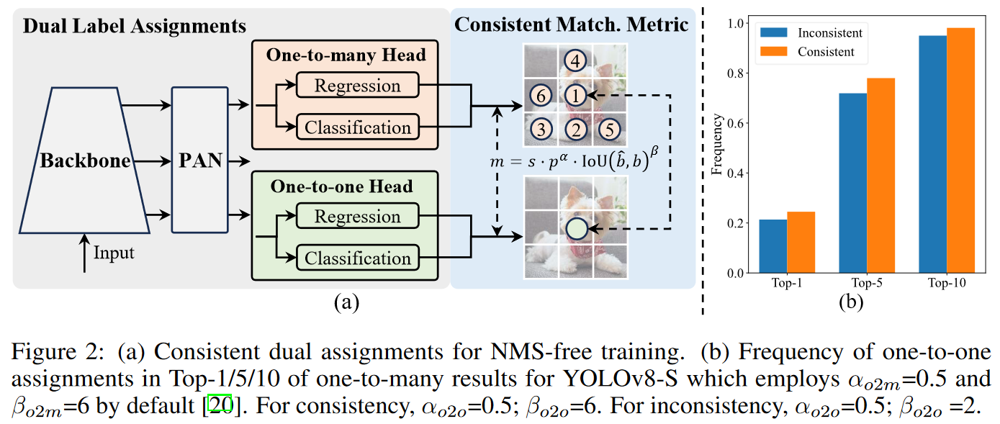
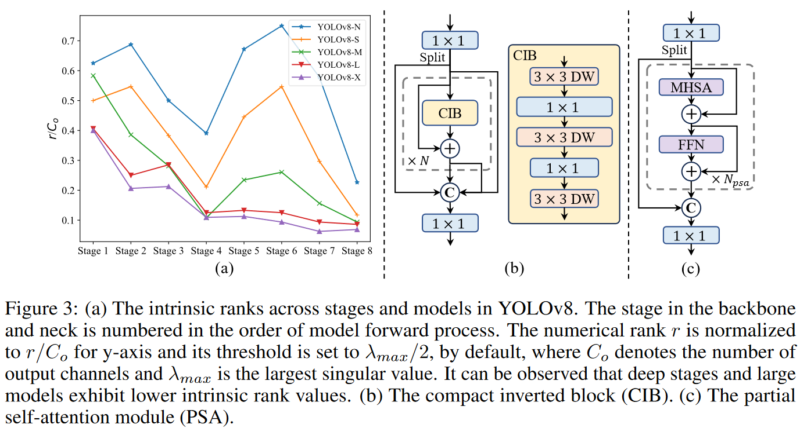
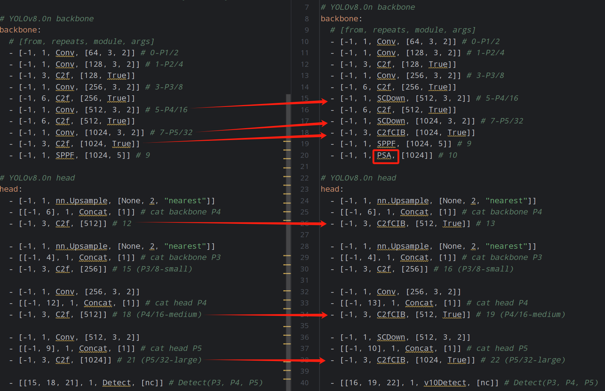

# YOLOv10

## 摘要

问题：依赖于非极大值抑制（NMS）进行后处理阻碍了YOLO模型的端到端部署，并对推理延迟产生了不利的影响

论文提出：从**后处理和模型架构**两方面进一步提高YOLO模型的性能效率边界

- 无NMS训练的一致性双重分配策略：该策略同时带来了竞争力的性能和较低的推理延迟
- 效率-准确性驱动的YOLO模型设计策略

## 引言

1. YOLO在训练过程中通常采用一对多标签分配策略，即一个真实物体对应多个正样本。经管这种方法带来较好的性能，但在推理时需要依赖NMS来选择最佳的正预测。
2. YOLO模型中仍存在大量冗余计算

## 相关工作

- 实时目标检测
- 端到端目标检测

## 方法

#### 3.1 用于无NMS训练的一致性双重分配（Consistent Dual Assignments for NMS-free Training）

在训练过程中，YOLO通常利用TAL（任务对齐的标签分配）将多个正样本分配给每个实例。提出一种无NMS训练策略，通过**双重标签分配和一致匹配度量**实现了高效且具有竞争力的性能。

图2解释：

（a）一致性双重分配用于无NMS训练：

- Dual Label Assignments

### 3.2 Holistic Efficiency-Accuracy Driven Model Design

**效率驱动的模型设计** 

（1）轻量级分类头

（2）Spatial-channel decoupled downsampling

**YOLOv10与v8结构对比**

## 4 实验

### 4.1 实现细节

选择**YOLOv8 作为基线模型**，因为它具有很好的延迟-精度平衡和在不同模型大小下的可用性。我们采用一致对偶任务进行无NMS训练，并在此基础上进行整体效率-精度驱动的模型设计，从而得到我们的YOLOv10模型。YOLOv10和YOLOv8有相同的变体，即N / S / M / L / X。此外，我们通过简单地增加YOLOv10 - M的宽度比例因子，得到了一个新的变体YOLOv10 - B。我们在COCO 上验证了所提出的检测器，并在相同的划痕训练集[ 20、59、56 ]下进行了测试。此外，所有模型的延迟在T4 GPU和TensorRT FP16上进行了测试[ 71 ]。

### 4.2 和SOTA相比

