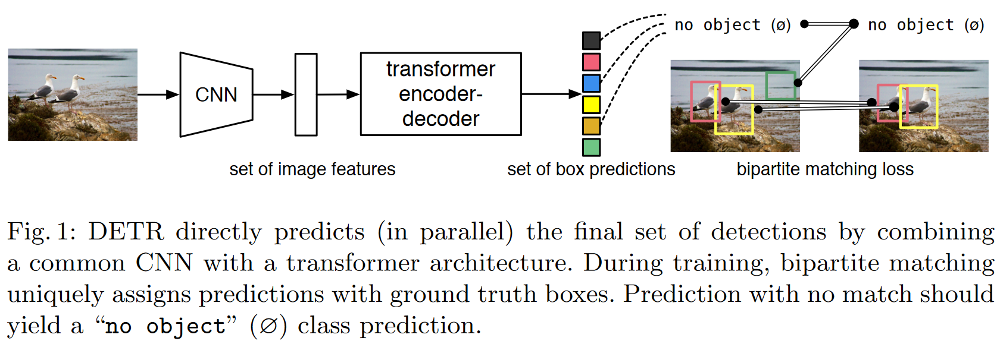
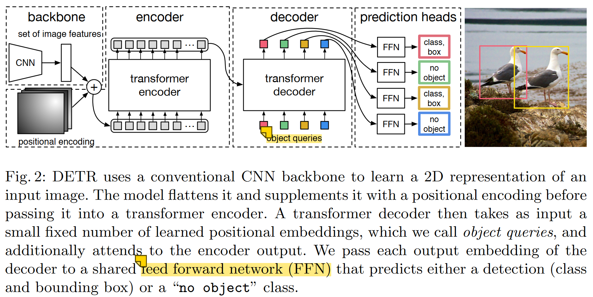
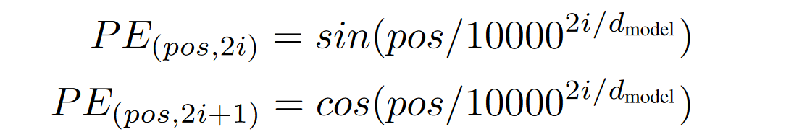
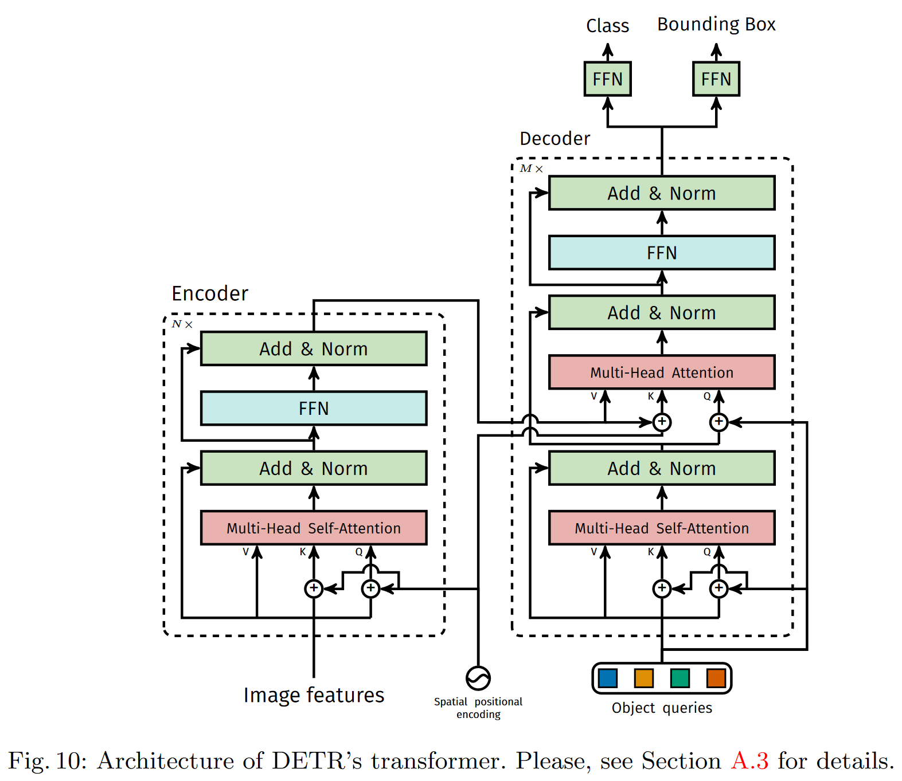

# End-to-End Object Detection with Transformers

前向流程：

- 使用CNN网络（**resnet50**）提取图片特征
- 全局建模：图片特征拉成一维，输入Transformer Encoder 中进行全局建模，进一步通过自注意力学习全局特征。
  之所以使用Transformer Encoder，是因为Transformer 中的自注意力机制，使得图片中的每个点（特征）都能和图片中所有其他特征做交互了，这样模型就能大致知道哪块区域是一个物体，哪块区域又是另一个物体，从而能够尽量保证每个物体只出一个预测框。所以说这种全局特征非常有利于移除冗余的框。
- 通过Transformer Decoder 生成N个预测框set of box prediction（默认取N=100，也就是一张图固定生成100个预测框）。
- 计算二分图匹配损失（bipartite matching loss），选出最优预测框，然后计算最优框的损失。
  计算N个预测框与所有GT box（真实框）的matching loss，然后通过**二分图匹配算法**来选出与每个物体最匹配的预测框。比如上图中有两个物体，那么最后只有两个框和它们是最匹配的，归为前景；剩下98个都被标记为背景（no object）。最后和之前的目标检测算法一样，计算这两个框的分类损失和回归损失。



### 3.2 DETR architecture

下面参考官网的一个demo，以输入尺寸3×800×1066为例进行前向过程：

- CNN提取特征（[800,1066,3]→[25,34,256]）
  backbone为ResNet-50，最后一个stage输出特征图为25×34×2048（32倍下采样），然后用1×1的卷积将通道数降为256；
- Transformer encoder 计算自注意力（[25,34,256]→[850,256]）
  将上一步的特征拉直为850×256，并加上同样维度的位置编码（Transformer本身没有位置信息），然后输入的Transformer encoder进行自注意力计算，最终输出维度还是850×256；
- Transformer decoder解码，生成预测框
    decoder输入除了encoder部分最终输出的图像特征，还有前面提到的`learned object query`，其维度为100×256。在解码时，learned object query和全局图像特征不停地做across attention，最终输出100×256的自注意力结果。
      这里的object query即相当于之前的anchor/proposal，是一个硬性条件，告诉模型最后只得到100个输出。然后用这100个输出接FFN得到分类损失和回归损失。
- 使用检测头输出预测框
  检测头就是目标检测中常用的全连接层（FFN），输出100个预测框（$ x_{center},y_{center}$,w,h）和对应的类别。
  使用二分图匹配方式输出最终的预测框，然后计算预测框和真实框的损失，梯度回传，更新网络。



## 4 实验

**技术细节**

我们使用AdamW 训练DETR，将初始transformer的学习率设置为$10^{-4}$，主干网络的学习率设置为$10^{-5}$，权重衰减设置为$10^{-4}$。所有transformer权重均采用Xavier初始化，主干网络则使用来自torchvision的ImageNet预训练ResNet模型，且**批归一化层被冻结**。我们报告了两种不同主干网络的结果：ResNet50和ResNet-101，分别称为DETR和DETR-R101。按照[21]的做法，我们通过在主干网络的最后一个阶段添加膨胀并去除该阶段第一个卷积的步幅来增加特征分辨率。相应的模型分别称为DETR-DC5和DETR-DC5-R101（膨胀的C5阶段）。这种修改将分辨率提高了两倍，从而提高了小目标的性能，但代价是编码器中的自注意力计算成本增加了16倍，整体计算成本增加了2倍。表1中给出了这些模型和Faster R-CNN的FLOPs的全面比较。

## 代码

**models/文件夹下**

1、backbone.py

`FrozenBatchNorm2d` 类：是 `DETR` 代码库中的一个自定义批归一化层。它的主要功能是在推理阶段固定住均值和方差，不更新它们。这对于预训练模型在转移学习任务中的稳定性和性能有帮助。`FrozenBatchNorm2d` 一般在冻结预训练模型的某些部分时使用，以保持这些层的统计特性不变。

`Joiner`类：用于**将骨干网络的输出特征与位置编码相结合**

2、detr.py

3、position_encoding.py

 pos是位置，i是维度



$d_{model}$ = num_pos_feats = 64：位置编码的维度。通常情况下，这个值为64，意味着每个位置将编码成一个长度为128（64对正弦和余弦）的向量。

temperature = 10000

```python
class PositionEmbeddingSine(nn.Module):
    """
    This is a more standard version of the position embedding, very similar to the one
    used by the Attention is all you need paper, generalized to work on images.
    """
    def __init__(self, num_pos_feats=64, temperature=10000, normalize=False, scale=None):
        super().__init__()
        self.num_pos_feats = num_pos_feats
        self.temperature = temperature
        self.normalize = normalize
        if scale is not None and normalize is False:
            raise ValueError("normalize should be True if scale is passed")
        if scale is None:
            scale = 2 * math.pi
        self.scale = scale

    def forward(self, tensor_list: NestedTensor):
        x = tensor_list.tensors
        mask = tensor_list.mask
        assert mask is not None
        not_mask = ~mask
        y_embed = not_mask.cumsum(1, dtype=torch.float32)
        x_embed = not_mask.cumsum(2, dtype=torch.float32)
        if self.normalize:
            eps = 1e-6
            y_embed = y_embed / (y_embed[:, -1:, :] + eps) * self.scale
            x_embed = x_embed / (x_embed[:, :, -1:] + eps) * self.scale

        dim_t = torch.arange(self.num_pos_feats, dtype=torch.float32, device=x.device)
        dim_t = self.temperature ** (2 * (dim_t // 2) / self.num_pos_feats)

        pos_x = x_embed[:, :, :, None] / dim_t
        pos_y = y_embed[:, :, :, None] / dim_t
        pos_x = torch.stack((pos_x[:, :, :, 0::2].sin(), pos_x[:, :, :, 1::2].cos()), dim=4).flatten(3)
        pos_y = torch.stack((pos_y[:, :, :, 0::2].sin(), pos_y[:, :, :, 1::2].cos()), dim=4).flatten(3)
        pos = torch.cat((pos_y, pos_x), dim=3).permute(0, 3, 1, 2)
        return pos
```


## 附录


