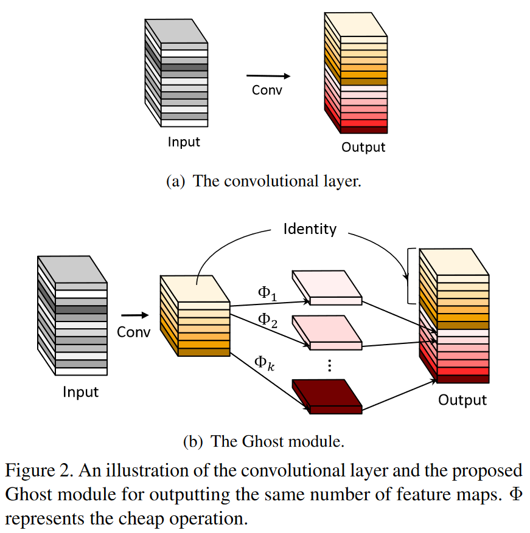
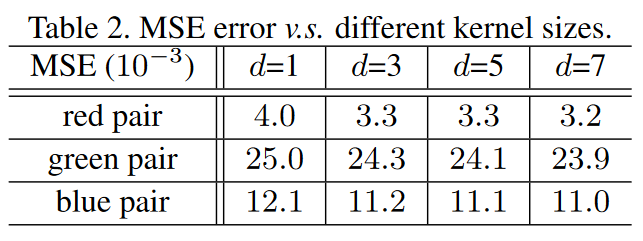

# GhostNet: More Features from Cheap Operations

## 3. 方法

### 3.1 Ghost Module



$Identity$ 表示恒等映射，$ \Phi_k​$表示廉价的线性变换。

**Step1：生成m个本征特征图(intrinsic feature maps)**
首先，给定输入特征图 $ X\in\mathbb{R}^{h\times w \times c}$ ，经过卷积核 $ f^{\prime}\in\mathbb{R}^{c\times k\times k\times m}$ 大小为$ 1 \times 1$的`PWConv` ，生成 $ m$个本征特征图 $ Y\in\mathbb{R}^{h\times w\times m}$。$ m\leq n$，输入特征图与输出特征图的高和宽一致。为简单起见，这里省略偏置项，该过程可以表示为：
$$
Y^{\prime}=X*f',\quad(2)
$$
**Step2：生成n个Ghost特征图**
然后，将本征特征图$ Y^{\prime}​$ 每一个通道的特征图$ y^{\prime}_i​$ ，通过一系列廉价的线性变换 $ \Phi_{i,j}​$  ，以生成 $ m\cdot(s-1) ​$个Ghost特征图$  y_{ij} ​$，公式表达如下：
$$
y_{ij}=\Phi_{i,j}(y^{\prime}_i),\quad \forall i=1,...,m,\quad j=1,...,s,\quad(3)其中，y i ′ y^{\prime}_iy i′  是 Y ′ Y^{\prime}Y ′  中第i ii个原始特征图，上述函数中的 Φ i , j \Phi_{i,j}Φ i,j  是第j jj个线性变换，用于生成第j jj个Ghost特征图 y i j y_{ij}y ij 。也就是说，y i ′ y^{\prime}_iy i′  可以具有一个或多个Ghost特征图 { y i j } j = 1 s \{y_{ij}\}_{j=1}^{s}{y ij } j=1s 。最后的 Φ i , s \Phi_{i,s}Φ i,s  是用于保留本征特征图的恒等映射。通过廉价的线性变换，生成 m ⋅ ( s − 1 ) m\cdot(s-1)m⋅(s−1) 个Ghost特征图 Y = [ y 11 , y 12 , ⋯   , y m s ] Y=[y_{11},y_{12},\cdots,y_{ms}]Y=[y 
11
$$
其中，$ y^{\prime}_i $ 是 $ Y^{\prime}$  中第$ i$个原始特征图，上述函数中的 $ \Phi_{i,j}$  是第 $j$个线性变换，用于生成第 $j$个Ghost特征图 $ y_{ij}$ 。也就是说，$ y^{\prime}_i $ 可以具有一个或多个Ghost特征图 $ \{y_{ij}\}_{j=1}^{s}$ 。最后的 $ \Phi_{i,s}$  是用于保留本征特征图的恒等映射。通过廉价的线性变换，生成 $ m\cdot(s-1)$ 个Ghost特征图 $ Y=[y_{11},y_{12},\cdots,y_{ms}]$。

> s为超参数，用于生成 $m = n s m = \frac{n}{s}​$  个本征特征图。
>

**Step3：拼接特征图**
最后，将第一步得到的本征特征图和第二步得到的Ghost特征图拼接（identity连接），得到最终结果OutPut。公式表达如下：
$$
Y=\operatorname{Concat}([Y',Y'*\Phi_{i,j}]),
$$
注意线性运算Φ作用在每个通道上，其计算代价远小于普通卷积。在实际应用中，Ghost模块中可能存在多种不同的线性操作，例如3 × 3和5 × 5线性内核，这将在实验部分进行分析。

## 4. 实验



从表2中可以发现，所有的MSE值都非常小，这表明深度神经网络中的特征图之间有很强的相关性，这些冗余的特征图可以从几个内在的特征图中生成。除了上述实验中使用的卷积外，我们还可以探索其他一些低成本的线性操作来构建Ghost模块，如**仿射变换和小波变换**。然而，卷积是目前硬件已经很好支持的一种高效操作，它可以覆盖一些广泛使用的线性操作，如平滑、模糊、运动等。此外，虽然我们也可以学习每个滤波器的大小w . r . t .线性运算Φ，但是不规则的模块会降低计算单元( e.g. CPU和GPU)的效率。因此，我们建议将Ghost模块中的d设为固定值，并利用深度卷积实现方程。3用于后续实验中构建高效的深度神经网络。


## 代码

```python
class GhostModule(nn.Module):
    def __init__(self, inp, oup, kernel_size=1, ratio=2, dw_size=3, stride=1, relu=True):
        super(GhostModule, self).__init__()
        self.oup = oup
        init_channels = math.ceil(oup / ratio)
        new_channels = init_channels*(ratio-1)

        self.primary_conv = nn.Sequential(
            nn.Conv2d(inp, init_channels, kernel_size, stride, kernel_size//2, bias=False),
            nn.BatchNorm2d(init_channels),
            nn.ReLU(inplace=True) if relu else nn.Sequential(),
        )

        self.cheap_operation = nn.Sequential(
            nn.Conv2d(init_channels, new_channels, dw_size, 1, dw_size//2, groups=init_channels, bias=False),
            nn.BatchNorm2d(new_channels),
            nn.ReLU(inplace=True) if relu else nn.Sequential(),
        )

    def forward(self, x):
        x1 = self.primary_conv(x)
        x2 = self.cheap_operation(x1)
        out = torch.cat([x1,x2], dim=1)
        return out[:,:self.oup,:,:]
```

