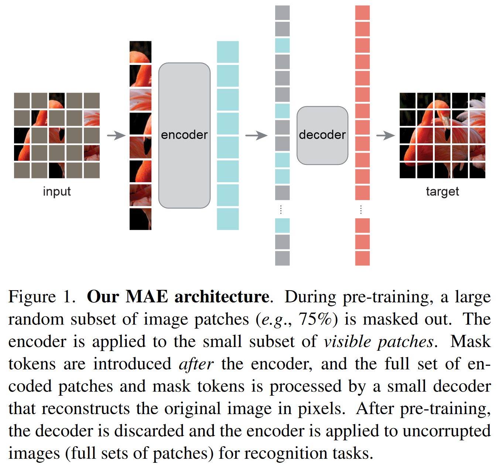

# Masked Autoencoders Are Scalable Vision Learners

参考：https://www.bilibili.com/video/BV1sq4y1q77t

## 摘要

两个核心的设计

1、非对称的encoder-decoder架构

2、其次，我们发现掩蔽高比例的输入图像，例如75 %，会产生一个非显然的、有意义的自监督任务。

结合这两种设计使我们能够高效有效地训练大型模型：我们加速训练( 3 ×以上)并提高精度。

我们的可扩展方法允许学习泛化能力强的高容量模型：例如，在仅使用ImageNet - 1K数据的方法中，原版ViT - Huge模型取得了最好的准确率( 87.8 % )。下游任务中的迁移性能优于监督预训练，并表现出良好的扩展行为。

## 3. 方法

- 图一是MAE整个模型的架构
- 输入一张图，首先将它切成一个一个的小块，图中涂成灰色的那些小块就是被盖住的部分，从没有盖住的部分可以看出，原图应该是一只红色的鸟
- 去掉那些被盖住的块，剩下的小块已经不太多了，因为3/4的地方都已经被盖住了
- 将剩下的小块放进encoder（也就是vit）中，得到每一个块对应的特征，然后将其拉长，再把被盖住的那些块重新放回到原来的位置，也就是说这个被拉长的东西其实就是原始图片拉成的一条向量（其中没有盖住的部分就填上经过vit之后输出的特征，被盖住的地方依然是灰色的，这里其实就是一个位置信息，没有其他的可以表示的）
- 将得到的长向量输入到解码器中，解码器会尝试将里面的像素信息全部重构回来，使得最后的target训练出来就是原始的没有被掩码盖住的图片
- 这里的编码器画的稍微比解码器要高一点，这里的意思是说模型主要的计算来自于编码器，因为最重要的就是对图片的像素进行编码（编码器只需要处理没有被盖住的图片，也就是说一张图片其实只需要看到1/4的像素就行了，这样可以降低计算量，transformer的模型计算量都特别大，如果能够达到几倍的加速，其实也是很重要的事情），这是在预训练的时候所干的事情
- 如果想用这个模型来处理一个计算机任务的话，就只需要编码器就够了，解码器是不需要的，图片进来之后不需要对它做掩码，直接切成一个一个的小块，然后放进vit，就能得到所有块的特征的表示，这就可以当作是输入图片的特征表达，然后用来做所要处理的任务

**掩码** 

- 和vit一样，将整个图片割成一块一块的，每一块作为一个patch，也就是作为一个词
- 在采样的时候，随机的均匀的采样一些出来进行保留，剩下的全部用掩码盖住，文中将这种方法叫做随机采样。关键技术在于只采样少量的块出来，然后剩下的全部盖住，这样采样少量的块，使得它们的冗余度不是很高，这样的话，任务就不是那么简单（不会说是用简单的插值就能解决问题了）

**编码器**

- 其实就是一个vit，没有做任何改动，但是它只作用于可见的那些块中，具体的做法跟vit是一样的：将每一块拿出来，然后做线性的投影，再加上位置信息，这样就做成一个词进去了
- 但是不一样的是，如果这一块被盖住的话就不会进去了。所以如果有25%被选中，那么进入vit的话就只有25%的样本，这样的话就可以降低计算量

**解码器**

- 因为要重构被盖住的块的像素信息，所以它需要看到所有的块，包括没有被盖住的块（虽然没有被盖住，但是已经通过编码器将它表示成了潜表示）和被盖住的块（没有进入编码器）
- 解码器是对这些所有的块，通过共享的可以学到的向量来表示，也就是说每一个被盖住的块都表示成同样的向量，这个向量的值是可以通过学习得到的
- 解码器其实就是另外一个transformer，所以需要加入位置信息，不然就无法区分它对应的到底是哪一个是掩码（这里有一点不确定：要不要对那些编码器输出的潜表示也加上位置信息，因为它们其实已经加上过一次了，那么这个地方要不要再加上一次？）
- 解码器主要只在预训练的时候使用，当将模型用于做一些别的任务的时候，解码器是不需要的，只需要用编码对一个图片进行编码就可以了，这样的话比较灵活，想用什么东西，就可以用什么东西
  这里采用的是一个相对来说比较小的解码器的架构，使得它的计算开销相对于编码器来说，不到它的1/10 

## 6. 讨论和结论

## 代码

代码地址：https://github.com/facebookresearch/mae

默认采用ViT-Large