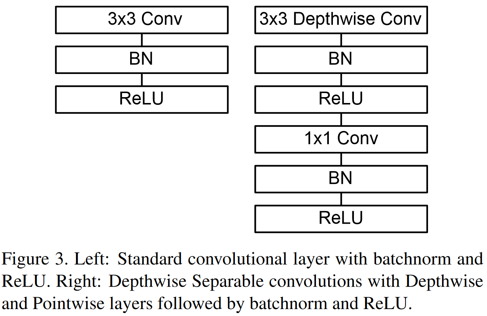
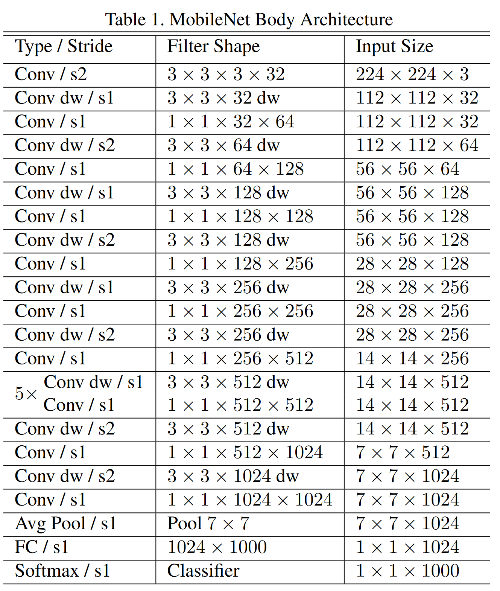

# MobileNets: Efficient Convolutional Neural Networks for Mobile Vision Applications

发表时间：2017

标准卷积和深度可分离卷积

MobileNetV1网络结构：13组深度可分离卷积，共28层

局限：

- 没有残差连接（ResNet发表于2015年）
- 很多Depthwise卷积核训练出来是0
  - 卷积核权重数量和通道数量太少，太“单薄”
  - ReLU
  - 低精度