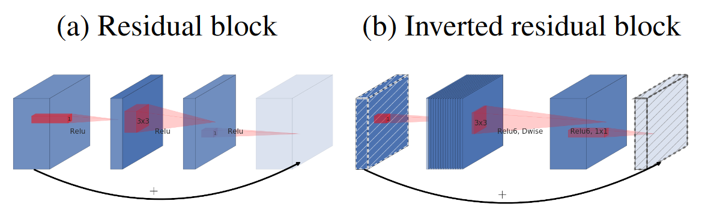
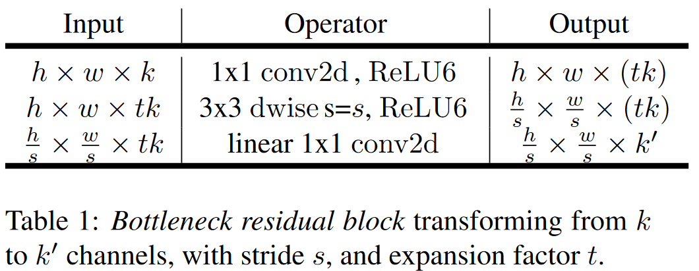
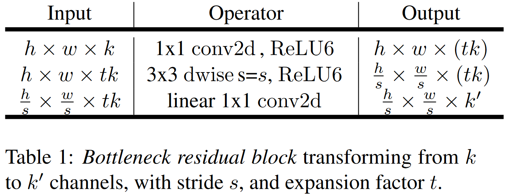
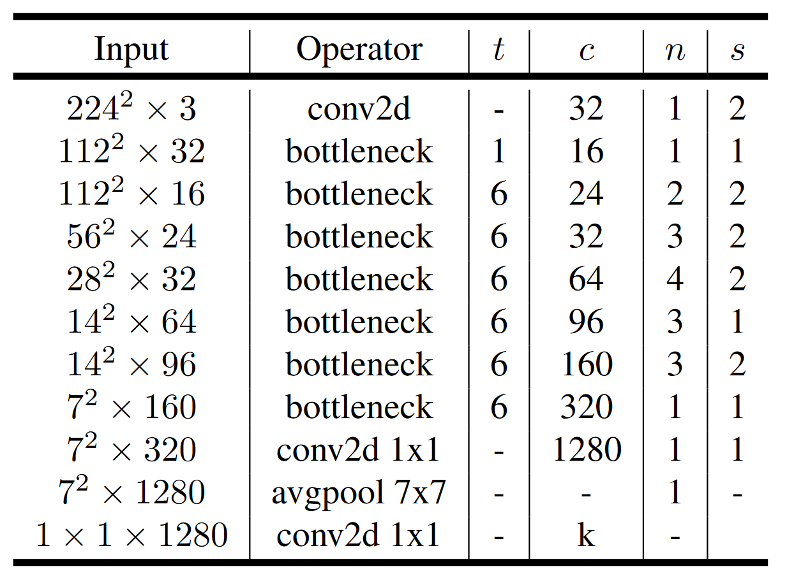
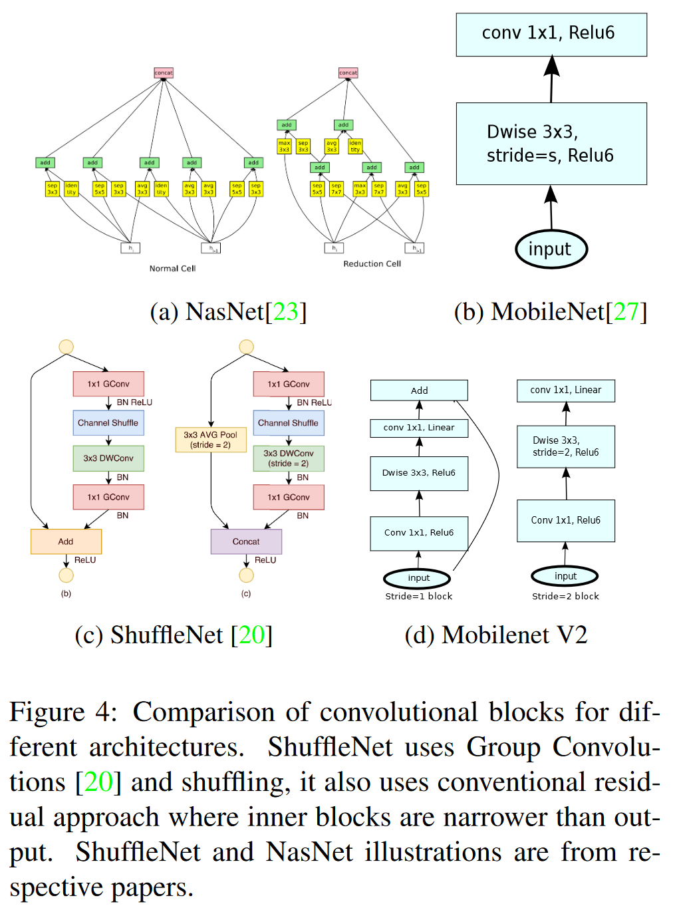
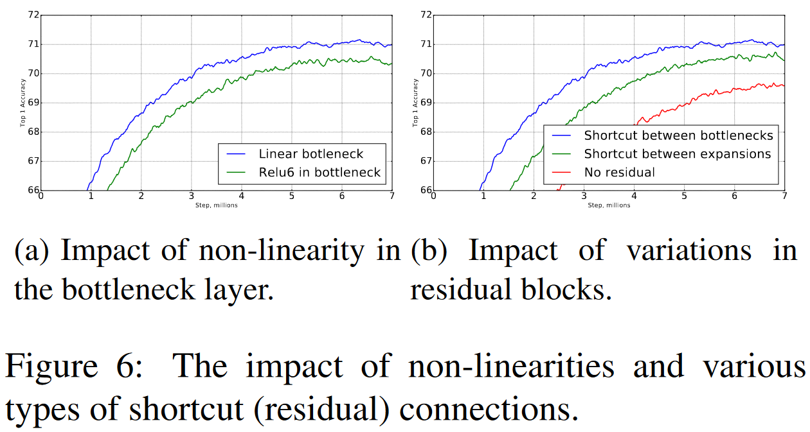

# MobileNetV2: Inverted Residuals and Linear Bottlenecks

MobileNetV2：逆残差结构和线性瓶颈层

MobileNetV2 是一种高效的卷积神经网络架构，专为在资源受限的设备上运行而设计。它由 Google 提出，主要用于移动设备和嵌入式设备上的图像分类、目标检测和语义分割任务。MobileNetV2 是 MobileNet 系列的第二代模型，较 MobileNetV1 进行了多项改进，提高了性能和效率。

### MobileNetV2 的主要特点

1. **深度可分离卷积（Depthwise Separable Convolutions）**:
   - **Depthwise Convolution**: 对每个输入通道分别进行卷积。
   - **Pointwise Convolution (1x1 Convolution)**: 用 1x1 卷积将每个输入通道与输出通道进行组合。

2. **倒残差结构（Inverted Residuals）**:
   - 在 MobileNetV2 中，引入了倒残差结构，即在残差块中首先进行通道数的扩展，然后进行深度可分离卷积，最后再进行通道数的压缩。这样可以更好地捕捉特征，同时减少计算量。

3. **线性瓶颈（Linear Bottlenecks）**:
   - 在倒残差块中，使用线性激活函数代替非线性激活函数（如 ReLU），从而减少信息丢失。

4. **轻量化和高效性**:
   - 通过使用深度可分离卷积和倒残差结构，MobileNetV2 能够在保持高精度的同时显著减少模型参数和计算量，非常适合在移动设备和嵌入式设备上部署。

### MobileNetV2 的网络结构

MobileNetV2 的网络结构由多个倒残差块（Inverted Residual Blocks）组成，每个块包括以下部分：

1. **扩展卷积**: 使用 1x1 卷积扩展通道数。
2. **深度卷积**: 使用 3x3 深度可分离卷积处理特征。
3. **压缩卷积**: 使用 1x1 卷积压缩通道数。
4. **线性瓶颈**: 在压缩卷积后使用线性激活函数。

### 总结

MobileNetV2 通过引入倒残差结构和线性瓶颈，显著提高了模型的性能和效率，使其成为资源受限设备上常用的卷积神经网络模型之一。通过深度可分离卷积和高效的网络设计，MobileNetV2 在移动设备和嵌入式设备上得到了广泛应用。

## 3. Preliminaries, discussion and intuition

标准残差模块：先降维后升维

“逆转”残差模块：先升维后降维



使用ReLU6激活函数：当x > 6 时，y的值限制在6，这样值域就为[0,6]，因为它在低精度计算中具有鲁棒性



## 4. 模型架构




t：expansion rate

c：卷积核个数

n：重复次数

s：首个模块的步长



MobileNetV2：

左边是步长为1的正常模块

- 第一个 1 * 1卷积是为了升维
- 第二个 1*1卷积是为了降维

右边是步长为2的下采样模块



## 6. 实验

### 6.4 消融实验

线性激活函数：更早的收敛，性能也比较好

残差连接连低维




### 代码示例

以下是一个使用 PyTorch 实现 MobileNetV2 的示例：

```python
import torch
import torch.nn as nn
import torch.nn.functional as F

class InvertedResidual(nn.Module):
    def __init__(self, inp, oup, stride, expand_ratio):
        super(InvertedResidual, self).__init__()
        hidden_dim = int(inp * expand_ratio)
        self.use_res_connect = stride == 1 and inp == oup

        layers = []
        if expand_ratio != 1:
            layers.append(nn.Conv2d(inp, hidden_dim, 1, 1, 0, bias=False))
            layers.append(nn.BatchNorm2d(hidden_dim))
            layers.append(nn.ReLU6(inplace=True))
        layers.extend([
            nn.Conv2d(hidden_dim, hidden_dim, 3, stride, 1, groups=hidden_dim, bias=False),
            nn.BatchNorm2d(hidden_dim),
            nn.ReLU6(inplace=True),
            nn.Conv2d(hidden_dim, oup, 1, 1, 0, bias=False),
            nn.BatchNorm2d(oup),
        ])
        self.conv = nn.Sequential(*layers)

    def forward(self, x):
        if self.use_res_connect:
            return x + self.conv(x)
        else:
            return self.conv(x)

class MobileNetV2(nn.Module):
    def __init__(self, num_classes=1000, width_mult=1.0):
        super(MobileNetV2, self).__init__()
        input_channel = 32
        last_channel = 1280
        inverted_residual_setting = [
            # t, c, n, s
            [1,  16, 1, 1],
            [6,  24, 2, 2],
            [6,  32, 3, 2],
            [6,  64, 4, 2],
            [6,  96, 3, 1],
            [6, 160, 3, 2],
            [6, 320, 1, 1],
        ]

        input_channel = int(input_channel * width_mult)
        self.last_channel = int(last_channel * max(1.0, width_mult))
        features = [nn.Conv2d(3, input_channel, 3, 2, 1, bias=False),
                    nn.BatchNorm2d(input_channel),
                    nn.ReLU6(inplace=True)]
        
        for t, c, n, s in inverted_residual_setting:
            output_channel = int(c * width_mult)
            for i in range(n):
                stride = s if i == 0 else 1
                features.append(InvertedResidual(input_channel, output_channel, stride, expand_ratio=t))
                input_channel = output_channel
        
        features.append(nn.Conv2d(input_channel, self.last_channel, 1, 1, 0, bias=False))
        features.append(nn.BatchNorm2d(self.last_channel))
        features.append(nn.ReLU6(inplace=True))
        self.features = nn.Sequential(*features)
        
        self.classifier = nn.Sequential(
            nn.Dropout(0.2),
            nn.Linear(self.last_channel, num_classes),
        )

    def forward(self, x):
        x = self.features(x)
        x = x.mean([2, 3])
        x = self.classifier(x)
        return x

# 创建 MobileNetV2 模型实例
model = MobileNetV2(num_classes=1000)
```

### 