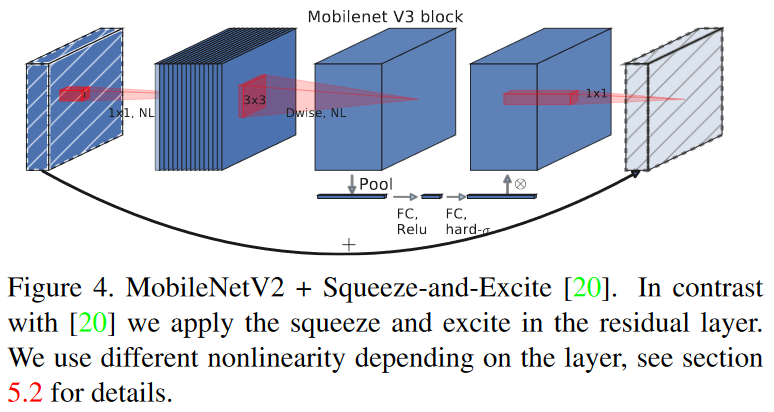
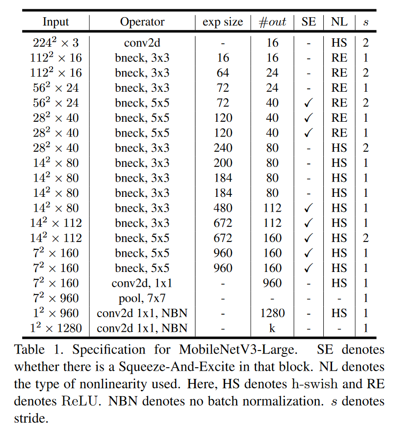

# Searching for MobileNetV3

论文地址：https://arxiv.org/abs/1905.02244

network architecture search (NAS)

NetAdapt algorithm

两个新的MobileNet模型：

- MobileNetV3 - Large

- MobileNetV3 - Small

表1。Mobilenetv3 - large说明。

- SE表示该块中是否存在Squeeze-And-Excite。

- NL表示使用的非线性类型。其中，HS表示h - swish，RE表示ReLU。

- NBN表示不进行批归一化，s表示步幅。
- exp_size代表benck中第一部分升维后的channel

