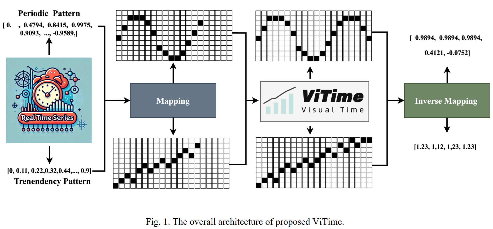
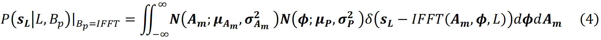
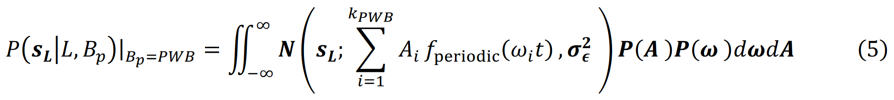
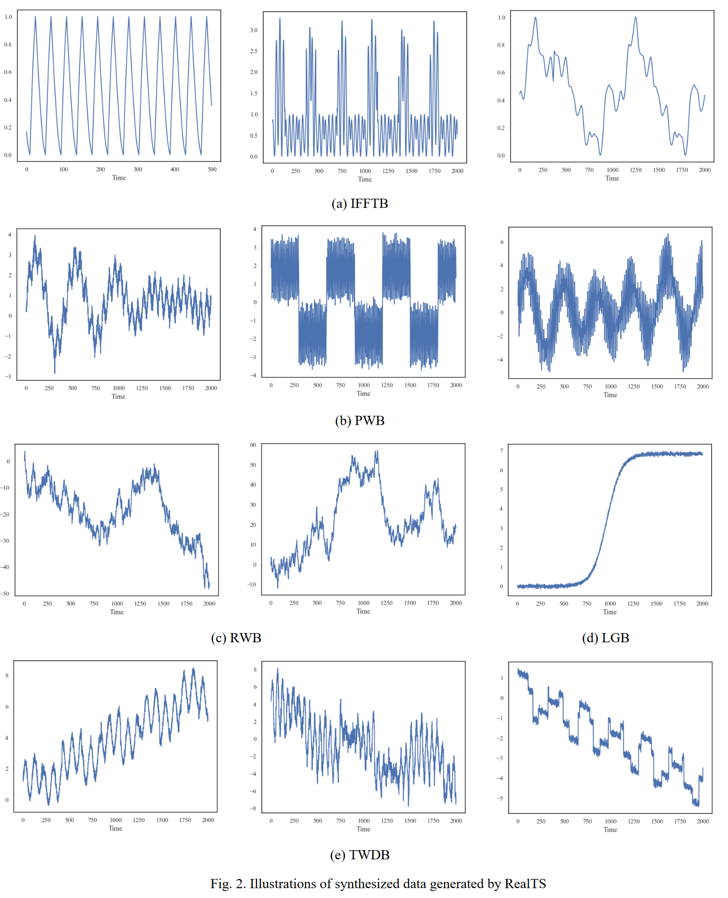
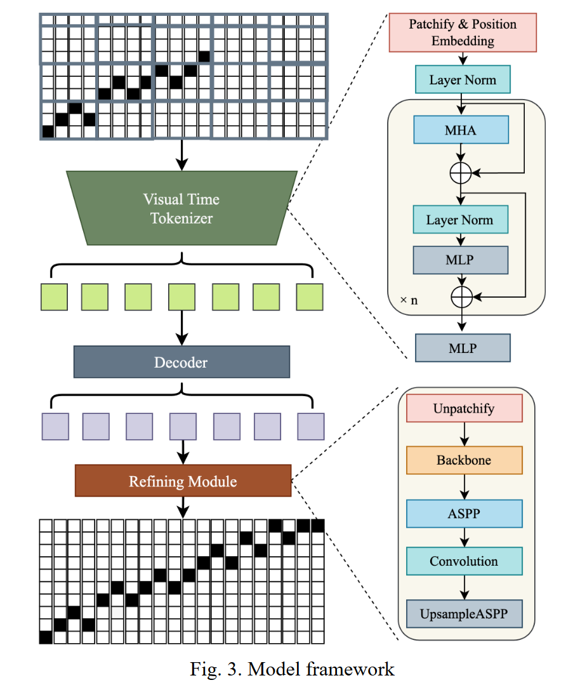
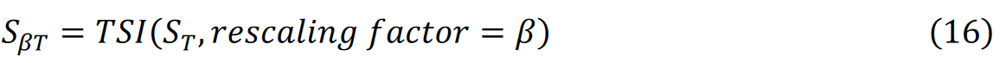
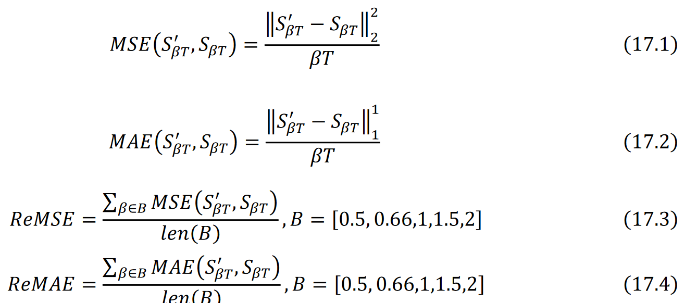
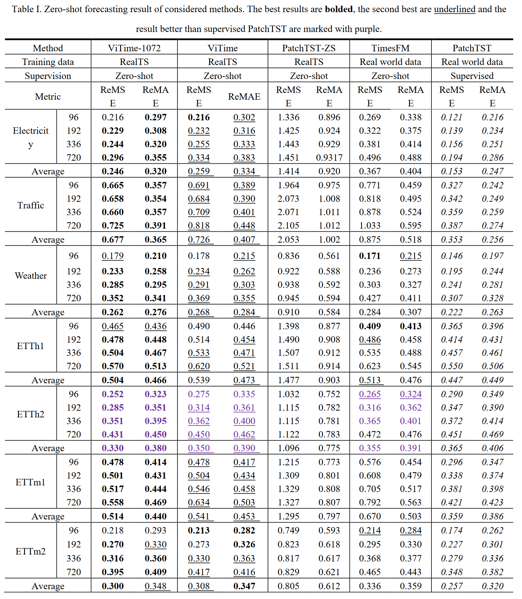
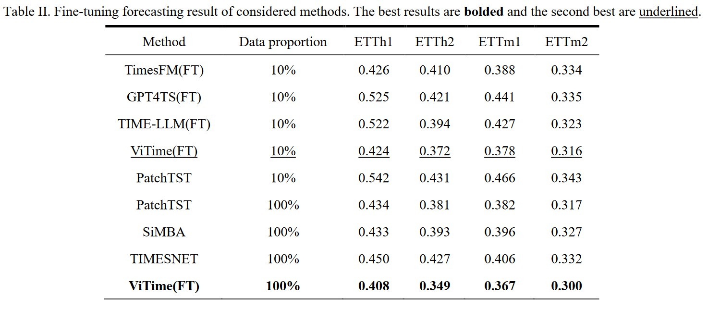

# ViTime A Visual Intelligence-Based Foundation Model for Time Series Forecasting

代码地址：https://github.com/IkeYang/ViTime

## 摘要

大型预训练模型在自然语言处理( NLP )和计算机视觉( CV )领域的成功为构建时间序列预测( TSF )基础模型开辟了新的途径。传统的TSF地基模型严重依赖于数值数据拟合。相比之下，人脑天生擅长处理视觉信息，更喜欢通过观察可视化的序列来预测未来的趋势。从仿生的角度来看，利用模型直接处理数值序列可能并不是实现通用人工智能( Artificial General Intelligence，AGI )最有效的途径。本文提出了一种新的基于视觉智能的TSF**基础模型**ViTime。ViTime利用可视化数据处理范式，克服了数值时间序列数据拟合的局限性。在一组以前看不到的预测数据集上的实验表明，ViTime取得了最先进的**零样本**性能，甚至在某些情况下超过了最好的单独训练的监督模型。这些发现表明，视觉智能可以显著增强时间序列分析和预测，为该领域更先进和通用的模型铺平道路。

## 引言

尽管取得了这些进展，但现有的基础时间序列模型仍然面临两个重大挑战。

1. 数值建模的局限性：首先，与大多数TSF模型类似，现有的基础模型都是通过直接拟合数值时间序列数据来训练的，这表明这些模型的主要信息载体是时间维度内的数值关系。相比之下，人类倾向于通过视觉表征来观察趋势，而不是直接处理数值。研究表明，人脑对视觉信息的处理效率高于数值型数据。彼得松[ 9 ]发现人脑比数值型数据更擅长处理视觉信息。类似地，Dondis [ 10 ]证明了视觉皮层快速识别模式、形状和颜色，使得图像和视频的处理速度快于文本和数字。这些发现自然地导致了一个假设问题：在通向AGI的道路上，使用视觉智能进行时间序列建模可能比传统的数值方法更有效?

2. 训练数据的局限性：其次，基础模型的训练数据通常由大规模的真实世界数据集组成[ 6 ]，这就提出了一个关键的问题：大规模的真实世界数据集能否全面地捕获通用时间序列模式的多样化范围?具体来说，一个模型应该具备哪些基础能力来解决一个通用的时间序列问题?

为了应对这些挑战，本文提出了一种新的基于视觉智能的时间序列基础模型- -视觉时间基础模型( Visual Time Foundation Model，ViTime )，旨在从视觉智能的角度开拓时间序列基础模型研究的新范式。此外，我们还提出了一种新的时间序列数据生成方法- - Real Time Series ( RealTS )，它将时间序列分析的基础知识分为"趋势性"和"周期性"，并在ViTime的训练过程中合成训练数据。ViTime通过将数值时间序列转换为**二值图像**，将数值时间相关性转换为二进制像素空间相关性。这种方法与大脑处理时间序列数据的熟练程度相一致。实验结果表明，当应用于不同领域和分辨率的各种未知数据集时，所提出的ViTime获得了最先进的零样本结果，并且在某些情况下，超过了最佳的单独训练的监督模型。此外，仅用10 %的领域数据微调，ViTime就可以获得比使用100 %域数据的最新最先进的监督模型更优越的性能。

## 相关工作

- 论文回顾了传统的时间序列预测方法，如 ARIMA 和其扩展模型，以及近年来深度学习在 TSF 中的进展，包括 RNN、LSTM、GRU 和基于 Transformer 的模型。

## 方法

### 3.2 总体架构

periodic pattern 周期模式



​       图1描述了所提ViTime框架的总体架构，由4个关键模块、实时序列合成模块、映射函数、所提ViTime模型和逆映射函数组成。本文首先介绍了一种新颖的时间序列数据生成算法Real Time Series ( Real TS )，该算法将时间序列基础模型所需的知识分为**周期模式和趋势模式**两种，并据此合成数值时间序列数据。然后通过**映射函数**将生成的数值型时间序列数据映射为二值图像，将时间序列数据的数值关系转换为空间分布关系。

### 3.3 真实时间序列（RealTS）合成

​        一个稳健的TSF基础模型应该集成两种基本的时间序列变化知识：周期模式和趋势模式，它们包含了时间序列数据中的固有模式和方向变化。然而，真实世界的数据集通常缺乏对这些周期性和基于趋势的波动的完整频谱的表示，限制了模型在不同场景下的泛化能力和有效地学习潜在的动态。

在**周期假设$φ_p$ **下，我们采用两种截然不同的数据行为模式：

快速傅里叶逆变换行为( IFFTB )：为了确保合成的数据充分反映真实世界时间序列的变化模式，我们利用( 4 )中的快速傅里叶逆变换( IFFT )来模拟真实世界周期时间序列的基本行为：



周期波行为( Periodic Wave Behavior，PWB )：该行为通过叠加多个周期波来产生数据。将数据建模为正弦、余弦和其他周期函数，$f_{periodic }$，具有不同的频率和振幅：



在**趋势数据假设$φ_t$**下采用了三种不同的数据行为模式：

随机游走行为( Random Walk Behavior，RWB )：RWB将数据建模为一个随机过程，其中每个值都是前一个值加上一个随机步长：

Logistic增长行为( LGB )：LGB对数据进行Logistic增长函数建模，捕捉S型增长模式：

趋势波动数据行为( Trend Wave Data Behavior，TWDB )：TWDB结合了线性趋势和周期性波动：

在合成过程中，我们使用了各种数据增强技术来增强合成数据的多样性和鲁棒性，

- 多周期复制，它将生成的周期数据在多个周期上重复，以捕获长期的周期模式；
- 数据翻转；
- 卷积平滑和去趋势，从数据中去除潜在的趋势以分离出周期成分，使模型更容易学习这些模式；
- 数据扰动，即在数据中引入突变或异常，模拟现实世界的扰动，提高模型处理突发变化的能力等。

图2展示了RealTS产生的合成数据，展示了其产生具有各种周期模式的广泛时间序列的能力，使模型能够获得关于周期和趋势的广泛知识。预定义的先验/经验分布的详细设置见附录I。



### 3.4 基于二值图像的时间序列度量空间

空间定义函数、映射函数以及相关定理

### 3.5 ViTim模型



图3描述了所提出的ViTime模型的框架，它包括三个网络：视觉时间分词器、解码器和精炼模块。首先，对映射后的二值图像进行时间掩蔽，保证时间信息不被泄露。然后将被掩蔽的二值图像输入到视觉时间表征器中，并输出嵌入的表征。这些令牌随后被解码器解码，从而产生初始预测。最后，为了提高图像块交界处的生成质量，使用一个优化模块来输出最终的二值图像预测。

## 实验

### 4.1 实验配置

#### 4.1.3 评估指标

基于真实世界数据训练的TSF基础模型可能存在**测试集泄露问题**。为了解决这个问题并确保公平的实验比较，提出了两个用于零样本评估的指标：重新定标-MAE ( ReMAE )和重新定标- MSE ( ReMSE )。ReMAE / ReMSE的主要概念是用不同的时间分辨率对测试数据集进行重新标度，例如，使用时间序列插值( TSI )方法，长度为T的原始测试时间序列为重新定标T到β T，如( 16 )所示。



ReMAE和ReMSE的计算公式如下所示：



### 4.2 零样本评估

表1报告了零样本实验结果。本文提出的ViTime - 1072模型在几乎所有的实验中都取得了最高的准确率。当使用与其他基线模型相同的输入序列长度时，ViTime在几乎所有的数据集和预测长度中始终排名第一，显著优于TimesFM。值得注意的是，ViTime在某些情况下的精度甚至超过了全监督PatchTST模型，显示了本文提出的ViTime的优越性。基于RealTS生成数据训练的ViTime和PatchTST - ZS的对比结果表明，从视觉智能的角度建模TSF任务可以显著提高模型的鲁棒性和准确性，这进一步验证了ViTime框架从视觉智能角度设计的合理性



### 4.3 微调评估

为了进一步评估ViTime的性能，我们在这一部分进行了一系列的微调实验。Time FM [ 6 ]、GPT4TS [ 22 ]、TIME - LLM [ 8 ]等基础模型均使用10 %的训练数据进行微调。我们还考虑了最近的SOTA监督的TSF模型，包括SiMBA [ 23 ]、TIMESNET [ 24 ]和PatchTST [ 16 ]，使用了他们论文中报告的100 %的训练数据。使用10 %和100 %的训练数据对提出的ViTime进行微调，结果如表2所示。




## 结论

​        在本文中，我们介绍了一种基于视觉智能的TSF基础模型ViTime，以及一种新颖的数据生成方法**RealTS**。我们的方法旨在通过利用视觉处理能力来解决传统数值数据拟合模型的固有局限性，这与人脑在处理视觉信息方面的优势更加吻合。提出的**ViTime框架将数值化的时间序列数据转化为二值图像**，使应用视觉智能技术分析和预测时间序列趋势成为可能。此外，提出的RealTS算法可以系统地生成多样化的合成时间序列数据，封装了重要的周期和趋势特征，并为ViTime模型的训练提供了足够的知识。

​       大量的实验评估表明，ViTime可以达到最先进的零样本性能。同时，微调实验表明，即使使用10 %的数据进行训练，所提出的ViTime也能优于最新的完全监督模型，证实了视觉智能在时间序列分析中的优势。我们相信，ViTime的提出可以从方法论的角度为AGI处理时间序列提供重要的见解。


## 代码

ViTime

```python
class ViTime(nn.Module):
    """
    A combined model using Masked Autoencoder (MAE) and DeepLab for image processing.
    """

    def __init__(self, args=None):
        super().__init__()
        MAE_Modelsize = copy.deepcopy(args.modelSize)
        args.modelAda = True
        self.args = args
        self.model = ViTimeAutoencoder(args=args
        )
        args.modelSize = 40
        self.RefiningModel = RefiningModel(
  
            downsample_factor=args.downsample_factor,
            dropout=args.dropout, args=args
        )
        self.EMD = nn.Softmax(dim=-1)
        args.modelSize = MAE_Modelsize
        self.dataTool=Dataset_ViTime(args)
        self.device=args.device
```

对于Refining Module，我们设置mobilenetv2作为骨干网络