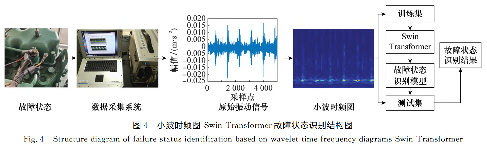

# 基于小波时频图与Swin Transformer的柴油机故障诊断方法

通过连续小波变换将原始信号表示为小波时频图，将小波时频图作为特征图输入到Swin Transformer进 行 训 练，实现柴油机故障状态识别。

小波时频图：对采集到的柴油机原始振动信号进行连续**小波变换**， 将其表示为二维彩色小波时频图。

Swin Transformer：Swin Transformer 是对 ViT 的演进

- 层级式结构的 Transformer：层级式结构不仅非常灵活，可以提供各个尺度的特征信息

- 移动窗口：由于自注意力是在局部窗口之内计算的，只要窗口大小固定，自 注意力的计算复杂度就是固定的，因此该模型的计算复杂度 随着图像大小线性增长，而不像 ViT 模型平方倍增长
- 基于窗口的多头自注意力（window-based multi-head self-attention，Ｗ－ＭＳＡ）

数据集

凯斯西储大学（ｃａｓｅ　ｗｅｓｔｅｒｎ　ｒｅｓｅｒｖｅ　ｕｎｉｖｅｒｓｉｔｙ，ＣＷＲＵ）公开的数据集

对比

短时傅里叶变换－Swin Transformer

小 波 时 频 图－ＶｉＴ 

小 波 时 频 图 －二 维 ＣＮＮ （ｔｗｏ－ｄｉｍｅｎｓｉｏｎａｌ　ＣＮＮ， ２ＤＣＮＮ）模型的训练结果进行对比

## 问题

1. 论文中，由于滚动轴承的振动信号和实验室采集到的柴油机原始振动信号均具有**时变非线性非平稳**的特点，因 此 使 用 ＣＷＲＵ 公开的轴承振动信号数据集验证论文中方法的可行性。那我们采集到的卷烟厂的信号是否也具有这个特点