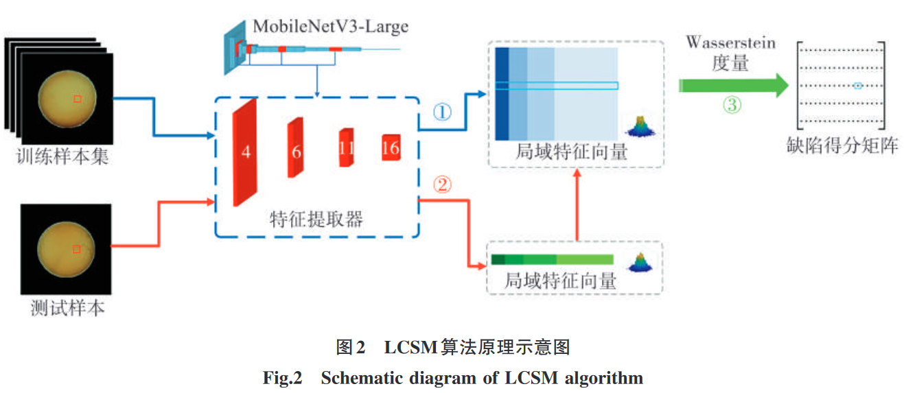
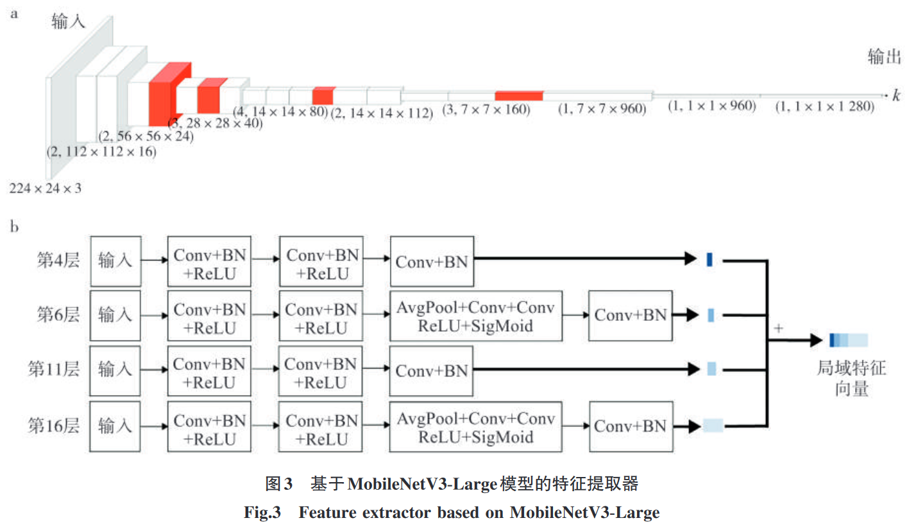
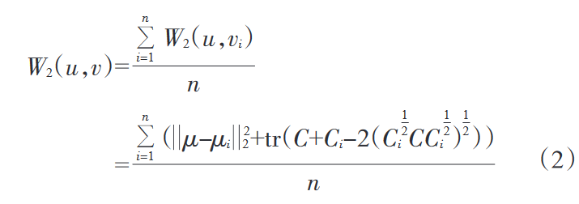

# 基于局域特征相似性度量的卷烟制品外观缺陷检测

局域特征相似性度量（Local Characteristic Similarity Metric，LCSM）

#### 1.2.2 基于局域特征相似性度量的外观缺陷检测算法

（1）训练图像的局域特征分布构建

MobileNetV3-Large 模 型 同 时 采 用 MobileNetV1 网络的深度可分离卷积结构和 MobileNetV2 网络的带线性瓶颈的逆残差结构， 使用激活函数 h-swish 减少计算量，具有参数量少、 携带轻量注意力机制、计算速度快等特点，在目标检测任务中表现出检测精度高 、速度快等优点 。

图 3a 为 MobileNetV3-Large 模型结构，该模型共包含 19 个卷积层，

- 其中卷积层 3、4 中特征图尺寸 为 56×56，
- 卷积层 5~7 中特征图尺寸为 28×28，
- 卷积层 8~11 中特征图尺寸为 14×14，
- 卷积层 14~16 中特征图尺寸为 7×7。

利用 LCSM 在每个尺度的卷积层中抽取 1 层作为特征提取器，分别是第 4、6、11 和 16 层（图 3a 中红色标识块）。4 个卷积层包含不同尺度的图像特征，在特征提取上具有一定代表性，且多尺度的信息组合能够丰富局域特征向量的信息表征能力。

利用 LCSM 抽取 MobileNetV3-Large 模型的第 4、6、11 和 16 层作为特征提取器，图 3b 为特征提取器结构。通过 4 个卷积层生成不同维度的局域特征向量，并将其进行连接，得到携带多层次信息的局域特征向量集合；将训练图像划分为 56×56 个区域，使 图像每个区域与生成的局域特征向量相关联，其中 56×56 是生成的局域特征向量的最大分辨率。

（2）测试图像的局域特征向量提取

（3）基于 Wasserstein 距离的局域相似性度量

度量测试图像局域特征向量分布与训练图像局域特征向量分布之间的距离时，可以采用 KL 散度、JS 散度、欧式距 离 、马氏距离 和 Wasserstein 距离等计算标准 。 

其 中，Wasserstein 距离在度量两个概率分布之间的距离时，能够充分考虑像素点的相对位置，且保持两幅图像之间的统计相似性［16］；对样本数据分布支撑的拓扑限制较少，可以衡量任意两个分布之间的距离，并能够学习到更加复杂的数据特征［17-18］。

每个检测区域与训练图像 数据集对应区域之间的 2 阶 Wasserstein 距离 W2 （u，v） 的计算公式为：

式中：u 为测试图像的数据特征；v 为训练图像数据 集的数据特征；vi 为每个训练图像的数据特征；u、vi 与 v 符合高斯分布，令 u =G（μ，C），vi =G（μi，Ci ），其中 μ和μi 分别为 u 和 vi 的均值，C 和 Ci 分别为 u 和 vi 的协 方差；n 为正常样本数量。

在获取每个检测区域的缺陷得分（2 阶 Wasserstein 距离）后，需要依据判定阈值 T 判定该图像正常或异常。